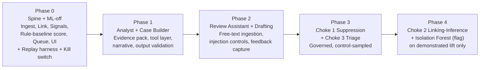

# SCP Episode Intelligence Layer — Finalization & Index

Two companion design documents plus this finalization note. Read this first.

- **[`01-current-approach-architecture.md`](01-current-approach-architecture.md)** — the deterministic v3 hybrid spine, with the ML scoring layer taken to full implementation depth and hardened. This is the audit-grade baseline.
- **[`02-agentic-approach-architecture.md`](02-agentic-approach-architecture.md)** — the agentic approach: three choke points that cut alert volume, plus the finalized agent roster and their tool surfaces. This builds *on* the spine in doc 01; it does not replace it.

Both documents contain: logical rationale, technical implementation (schemas, tool signatures, algorithms, config, tests), Mermaid diagrams, and a one-shot build prompt.

---

## The "one more check" — conclusions

Four things were verified before finalizing. All four hold.

**1. The detection boundary is correct and stays fixed.** Agents do not enter SCP's detection decision. "Replace the rule engine with agents" was narrowed to its only defensible meanings — *reduce* what reaches humans (pre-detection suppression, episode collapse, triage) and *augment* detection over time (agents discover rules a deterministic filter then enforces). Detection is the audited control; a missed detection is a regulatory breach, not a UX defect; and detection accuracy was never the stated problem. Volume and reconstruction overhead were, and that is exactly what the agentic design attacks.

**2. Which non-determinism is survivable.** Non-determinism in *discovery, linking-residue, triage, and interpretation* is survivable and valuable. Non-determinism in *the running detection control, scoring numbers, or queue ranking* is not. Every agent below sits on the survivable side of that line.

**3. The agent count is minimal, not padded.** The Case Builder is **code, not an LLM** — it is an orchestrator that assembles a verified evidence pack, and the source spec itself says to prefer plain code there. That leaves exactly six LLM agents, each with one job and no overlap. No agent computes a number; none has a write tool; each is individually kill-switchable.

**4. The ML layer is hardened, not expanded.** The current-approach ML layer stays a single optional model (Isolation Forest) plus the mandatory rule baseline. "Optimise the ML layer" means correctness and reproducibility hardening — deterministic inference, frozen reference window, drift detection, champion/challenger, calibration — **not** re-adding the autoencoder / OCSVM / five-model ensemble, which at ~40 features and three alert types is over-engineering that was already cut for cause.

---

## Finalized agent roster — who does exactly what

| # | Agent | Kind | Choke / layer | Trigger | Produces | Authority | Reproducible? |
|---|---|---|---|---|---|---|---|
| — | **Case Builder** | **Code (no LLM)** | Evidence assembly | Episode scored | Verified `evidence_pack` (structured) | Orchestrator only | Yes — deterministic |
| 1 | **Suppression-Discovery** | LLM, offline | Choke 1 — pre-detection | Governed cadence (e.g. weekly) | *Proposed* suppression rule as declarative config + evidence + measured precision | Proposes only; compliance approves | Output is deterministic config |
| 2 | **Linking-Inference** | LLM, online | Choke 2 — linking residue | Only on pairs S/M tiers could not link | *Proposed* `A-tier` edge + confidence + rationale | Proposes; quarantined tier | No — decision cached, replayed-by-record |
| 3 | **Triage** | LLM, online | Choke 3 — disposition | Per stable episode | `CLEAR_BAU` / `NEEDS_REVIEW` / `ESCALATE` + cited evidence | Auto-clears **only** `CLEAR_BAU`, under hard overrides + control sample; defaults to review | No — cached |
| 4 | **Analyst** | LLM, online | Interpretation | Lazily, on episode open | Business narrative + "why unusual" | Explains only; never a number/score/rank | No — stored as artifact of record |
| 5 | **Review Assistant** | LLM, interactive | Interpretation | During human review | Grounded answers + trace | Answers only | Per-turn validated |
| 6 | **Drafting** | LLM, interactive | Interpretation | On supervisor request | RFI / note draft | Drafts; human edits and sends; **never sends** | n/a |

The single most important structural fact: **remove all six agents and the system still ingests, links, scores, prioritises, and presents a working SLA-ordered queue.** The agents are a strict, kill-switchable add-on. If that ever stops being true, the architecture is wrong.

---

## The seven rails (apply to every agent, both documents)

1. No agent produces a number. Every statistic is a tool result from the deterministic spine.
2. No write tools anywhere — absent, not restricted. This is the structural prompt-injection mitigation.
3. Tools return computed answers (`p50`, `p95`, percentile), never raw row sets.
4. Every agent claim is validated programmatically against its tool trace before display; unsourced value → reject, retry once, fall back to template.
5. `temperature = 0`, pinned model + prompt version, full tool-call trace persisted.
6. Every suppress/clear path carries a mandatory random control sample (2–5%) routed to humans — the only false-negative estimator that exists.
7. Hard deterministic overrides sit **above** every agent decision (watchlist, open RFI, above-materiality, regulatory deadline → always human).

---

## Phasing

Phase 0 alone removes the reconstruction overhead that motivates the whole project and carries almost no model risk. Do not skip it to reach the agents faster. The volume-cutting choke points (1 and 3) are deliberately *late* — they change who sees what, so they ship only after the deterministic spine, the evidence packs, and the validation harness they depend on are proven in production.
