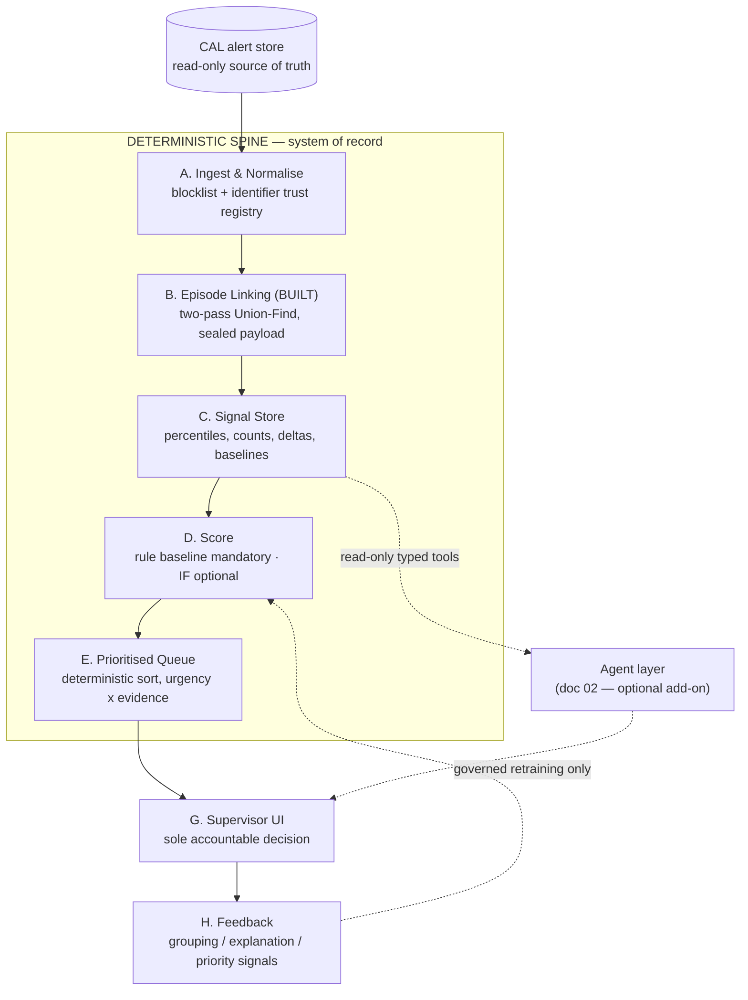
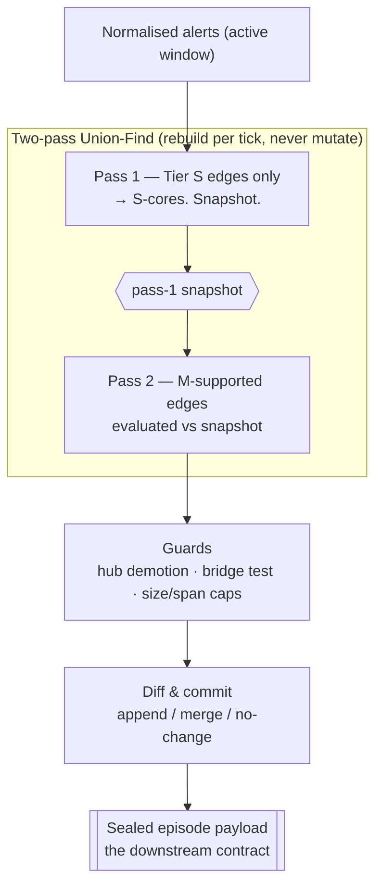
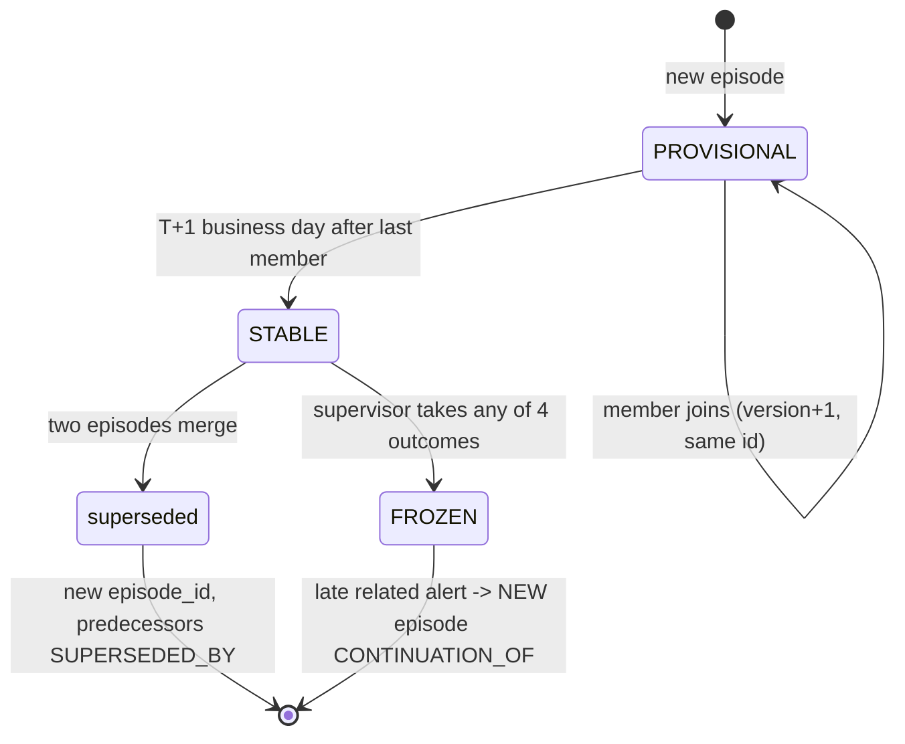
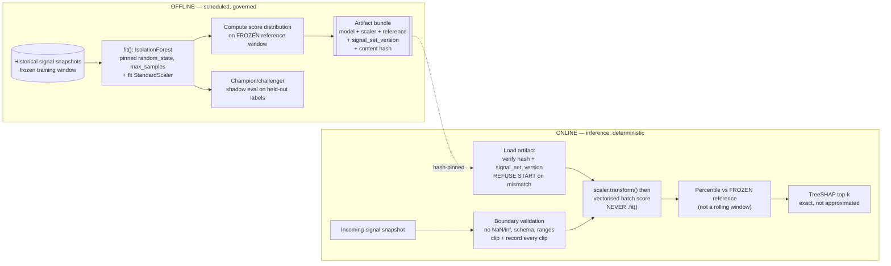
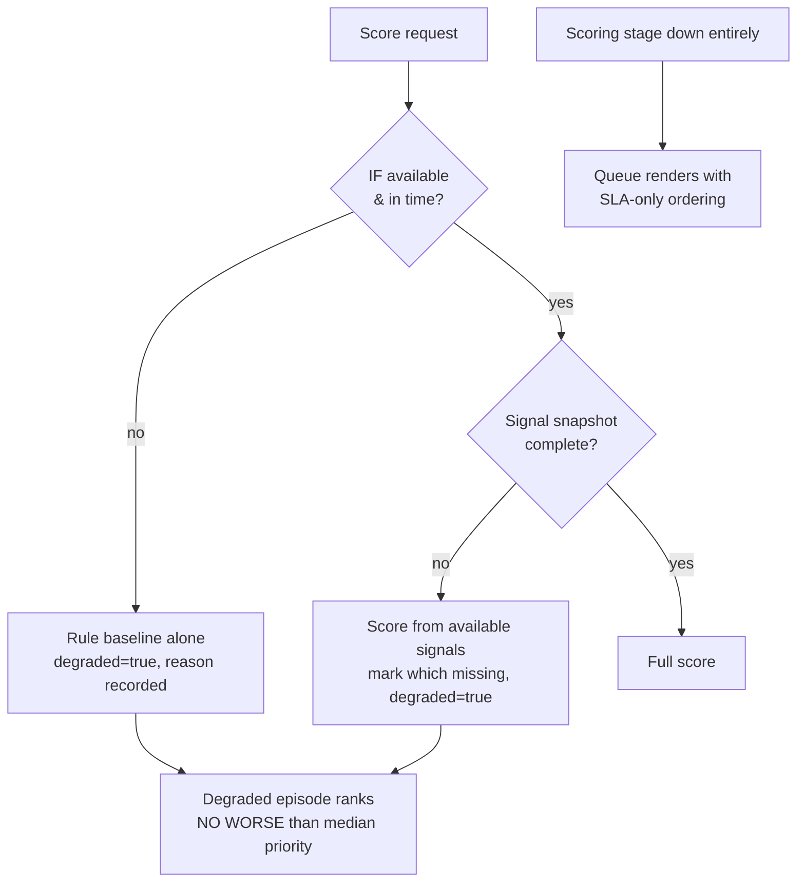
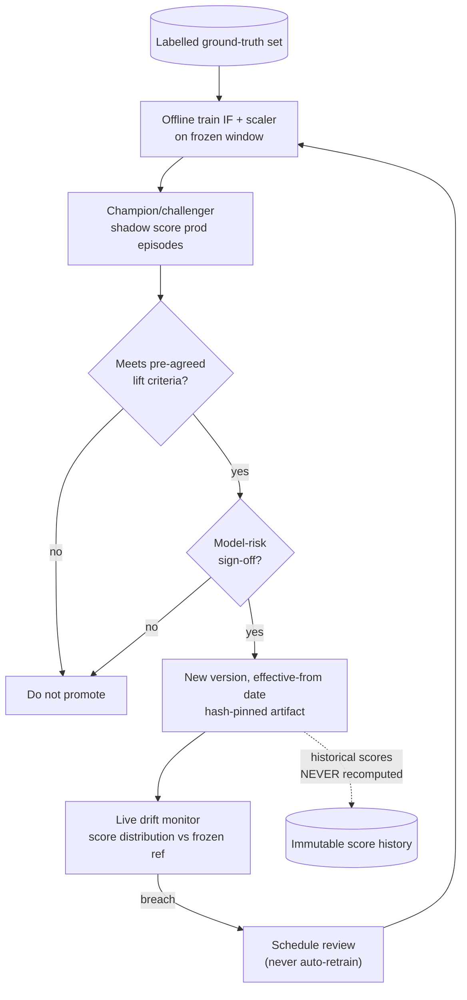

# Current Approach — Deterministic Spine + Hardened ML Layer

**Scope.** The intelligence layer that sits *after* SCP detection. It groups technically-generated alerts into episodes, scores and ranks them, and presents them to a supervisor with full traceability. SCP and the CAL alert store are read-only and never modified.

**Governing principle.** *Compute deterministically.* Every number — score, percentile, count, delta, rank — is produced by code and is reproducible from recorded inputs and versions. This document is the audit-grade baseline; the agentic layer (doc 02) is a strict add-on on top of it.

**What "optimise the ML layer" means here.** Hardening for correctness, reproducibility, and drift-safety — not adding models. At ~40 episode-level features across three alert types, one anomaly model (Isolation Forest) plus a mandatory rule baseline is the right amount of ML. The autoencoder, One-Class SVM, Prophet, and five-model ensemble were cut for cause; re-adding them is over-engineering. The optimization budget goes into §5 (Scoring), the deepest section here.

---

## 1. System topology



Steps A–E are the spine. The dashed edges are the only places the optional agent layer attaches; with it removed, the solid path is a complete working system.

---

## 2. Component A — Ingest & Normalise

**Logic.** Bad identifiers, not bad thresholds, cause most episode-explosion incidents. Normalisation is the highest-leverage control in the entire linking chain, so it runs before anything else and fails loudly rather than defaulting.

**Technical implementation.**

- **Identifier hygiene.** Every identifier is tested against a *versioned* degenerate-value blocklist before it can become a match key: empty, `N/A`, `NA`, `UNKNOWN`, `NULL`, `NONE`, whitespace-only, all-zeros, all-nines, house/internal counterparty codes, `MISC`, `OTHER`, shared suspense books. Track fill-rate and blocklist-hit-rate *per identifier per source system* as first-class metrics.
- **Identifier trust registry**, keyed `(source_system, identifier_name)`, carrying a trust level that can **downgrade a Tier S rule to Tier M** for a specific source. Without it, one bad feed silently poisons high-confidence linking and you learn via a supervisor complaint.
- **Time normalisation.** All timestamps to UTC, originating timezone retained. Business date derived from the firm calendar, not the timestamp date (a Tokyo 23:50 UTC booking and a London 00:10 UTC booking may not share a business day, and business date is a blocking key).
- **Validation failures → DLQ** with an ops exception. Never default a missing identifier to a placeholder; that is how degenerate keys are born.

---

## 3. Component B — Episode Linking (already built)

Summarized because downstream correctness depends on understanding its contract. Full spec lives in the source export.



**Confidence combines by noisy-OR**, not addition: `C = 1 − Π(1 − wᵢ)`. Tiers: **S** (identifier match, w=0.98), **M** (economic twin, w=0.65), **W** (supporting, w=0.30). Materialisation threshold `C ≥ 0.75` **plus a hard structural gate** — an edge materialises only if it carries at least one S or M rule. Weak evidence corroborates; it can never link.

**Type-compatibility matrix (veto, applied after confidence).** The three cross-type pairs (`CANCEL–LATE`, `CANCEL–AMEND`, `AMEND–LATE`) permit `S` or `M+W`. The three same-type pairs (`AMEND–AMEND`, `CANCEL–CANCEL`, `LATE–LATE`) are **Tier S only** — two LATE alerts on one desk on one day satisfy M1 trivially and would merge an entire day's backlog.

**Provable property.** Pass 2 evaluated against the snapshot (not incrementally) means an episode formed entirely from M-supported evidence can hold at most two alerts. **Every episode of size ≥ 3 therefore contains a deterministic identifier match** — worth more to compliance than any threshold number.

**Episode lifecycle** (state the whole system agrees on):



The **sealed payload** carries `lineage_root_id` (stable across merges — use this for all history, never `episode_id`), a pre-declared `member_ordering_key = (event_ts, booking_ts, alert_id)`, and `structural_facts` (type signature, size, span, edge-tier mix, flags) that downstream must **consume, never re-derive**.

---

## 4. Component C — Signal Store

**Logic.** Precomputed comparative aggregates whose only job is to answer, cheaply and exactly, "what makes this episode unusual?" It is not a general feature platform (that was cut with the four-model ensemble it existed to serve).

**Technical implementation.**

- **Point-in-time correctness is the single most common way a system validates beautifully and fails in production.** Every aggregate honours the episode's `as_of_ts`: `WHERE recorded_at <= :as_of_ts`. Enforce with a property test instrumented at the query layer, not by discipline.
- **Missingness is explicit.** A missing input yields an explicit `null` plus a `missing` entry naming the reason — never a silent zero. Zero and unknown are different facts; every downstream consumer, including the ML model boundary, must tell them apart.
- **Peer comparison records its own population.** `peer_key = (desk, asset_class, seniority_band)`; if population `< signal.peer_min_population`, fall back desk → business_line → firm, and **always record `peer_level_used` and `peer_population_n`**. "Compared to your desk (n=47)" and "compared to the firm (n=12,400)" are materially different claims.
- **Efficiency.** Cache per-alert signals by `(alert_id, signal_set_version)` — episodes re-version often, their members' per-alert signals do not. Batch rolling-window baselines on a schedule into a materialised table; look them up at episode time. Target p95 ≤ 2s per episode version.

Signal families: trader baselines (notional/lateness percentiles, alert counts, amend/cancel rates, tenure), peer comparison, episode signals (`type_signature` copied from `structural_facts`, recurrence by `lineage_root_id`, opening/closing notional, net delta, materiality, period-end flags), per-type signals (CANCEL: time-to-cancel, rebook deltas, cancel-reason rarity; AMEND: `is_economic_amend` — the highest-signal feature, economic field set is **config** because it is a compliance-visible definition — sequence no, favourability; LATE: lateness z vs baseline, outside-hours, valuation-cutoff span), and series signals (rolling z-score of daily alert counts per trader/type; insufficient history → null + marker, never imputed).

---

## 5. Component D — Score (the ML layer, hardened)

This is the deepest section. Two scorers combine by a *configured rule*, never a learned ensemble.

### 5.1 Rule baseline — mandatory, always runs

Policy-defined severity, fully explainable by construction. Config-driven weights over named components:

```
economic_amend_weight        × is_economic_amend
lateness_band_weight         × lateness_z bucket
cancel_after_cutoff_weight   × post_valuation_cutoff
recurrence_weight            × signature_recurrence_30d threshold
materiality_weight           × notional_current_percentile band
episode_complexity_weight    × size, span
```

Emit `rule_components` as a **named breakdown**, not just a total — in rule-only mode this *is* the explanation. This scorer alone is a complete, shippable Phase-0 system.

### 5.2 Isolation Forest — optional, flag-gated, offline-trained

`scoring.isolation_forest.enabled`. When false, no ML code path executes and the system has no ML dependency at all — verified by a test that boots the app with the flag off and asserts the ML module is never imported. Flag-gating lets model governance approve a rule-only configuration first and admit IF later without a re-architecture.

The non-negotiable structural split — **training is offline; inference fits nothing**:



Rules that make the ML score auditable and reproducible:

- **Inference never calls `.fit()`.** If any inference path fits, the design is wrong — non-deterministic scores, unbounded latency, unauditable model.
- **Hash-pinned artifact, verified at load; refuse to start on mismatch.** The artifact's `signal_set_version` must match the incoming snapshot; a mismatch is a **hard failure**, not a warning — scoring a v4 snapshot with a v3 model produces a number that looks fine and means nothing.
- **Determinism knobs pinned:** `random_state`, and thread count where tree traversal ordering is thread-dependent. Persist the fitted scaler and apply it at inference — never refit.
- **Percentile against a frozen reference window**, refreshed only on the governance cadence. A rolling window makes scores incomparable across time and silently breaks every trend report.
- **Vectorised batch scoring**, never row-by-row.
- **TreeSHAP** for explanations — exact for tree ensembles.

### 5.3 ML-layer optimizations (the hardening budget)

These are the concrete "optimise specially at the ML layer" items, in priority order:

| Optimization | Why it matters | Implementation |
|---|---|---|
| **Deterministic, portable inference (ONNX)** | Pinned Python + BLAS still drifts across hosts; ONNX Runtime with a fixed opset gives byte-stable scores across environments and decouples inference from the training stack | Export the fitted forest + scaler to ONNX at training time; verify parity against the sklearn artifact within a tolerance test before promotion; ship the ONNX bundle as the inference artifact |
| **Frozen reference window + score calibration** | Raw IF scores are not probabilities and are not comparable across retrains | Compute the reference-window score distribution at training; map raw score → percentile → calibrated band using that frozen distribution only; store the mapping in the artifact |
| **Score-distribution drift detection** | The earliest signal that the world moved under the model, before precision degrades | Monitor live score distribution vs the frozen reference (population stability index / KS); alarm on threshold breach; drift is a *signal to schedule review*, never an auto-retrain trigger |
| **Champion/challenger shadow scoring** | Admits a new model only on demonstrated lift, with model-risk sign-off | Score production episodes with both champion and challenger offline; compare against the held-out labelled set; promote only on pre-agreed criteria |
| **Optional conformal uncertainty band** | Turns a point score into "score ± with coverage guarantee" so a supervisor sees confidence, not false precision | Split-conformal on the reference window; emit a prediction interval alongside the percentile; keep it optional — do not ship unless model risk wants it |
| **Uncertainty/degraded floor in ranking** | A low-confidence or degraded ML score must never *bury* an episode | Feeds §6: a degraded episode ranks no worse than median |

Deliberately **not** done: re-adding OCSVM (percentile-correlation > 0.85 with IF, O(n²)–O(n³) fitting), autoencoder (unjustified at ~40 features), Prophet (a rolling z-score approximates seasonality adequately at this scope), or a multi-model consensus (its entire machinery existed to combine incomparable scores — pointless with one model).

### 5.4 Combination, numerical hygiene, degradation

```
final_score = rule_baseline × scoring.rule_baseline.weight
            + if_percentile × scoring.isolation_forest.weight   (when enabled)
renormalise weights when IF is disabled or unavailable
```

**Numerical hygiene at the model boundary:** reject NaN/inf, require all signals present per schema, enforce configured plausible ranges, clip to configured bounds and **record every clip** (a silently clipped input yields a silently wrong explanation), and reject schema violations to a scoring DLQ rather than coercing.

**Degradation ladder:**



A degraded score is never rendered as a normal one (visible badge, queue and detail). Ingestion and linking never block on scoring failure.

---

## 6. Component E — Prioritisation

**Logic.** Workload optimisation, not a verdict. Rank by operational urgency × anomaly evidence, split into outliers (prioritised) and inliers.

**Bands.** Urgency by business-days-to-deadline: `OVERDUE < 0`, `CRITICAL ≤ critical_bd`, `NEAR ≤ near_bd`, `STANDARD` else, `UNDATED` (no deadline). Evidence by `final_score` percentile: `HIGH ≥ high_pctl`, `ELEVATED ≥ elevated_pctl`, `NORMAL` else.

**Buckets.** `B0` any override fires · `B1` OVERDUE/CRITICAL · `B2` evidence HIGH & urgency NEAR/STANDARD · `B3` evidence ELEVATED · `B4` NORMAL & STANDARD. (B0–B2 = outliers, B3–B4 = inliers.)

**Strict total sort order** (the last key is not cosmetic — without a total order, paginated queues duplicate and skip rows, which supervisors experience as the system losing their work):

```
1. bucket ordinal
2. urgency band ordinal
3. final_score              DESC
4. max member alert score   DESC
5. episode size             DESC
6. earliest member alert_ts ASC   (anti-starvation)
7. episode_id               ASC   (deterministic tiebreak)
```

Materialise the composite into `queue_projection.sort_key` so pagination is a single indexed range scan. **Overrides** are deterministic config outside any model (open RFI, watchlist/under-investigation, crosses a regulatory/valuation cutoff, above materiality, repeat pattern by `lineage_root_id`, manual pin) — all force B0, the firing rule is always the displayed placement reason, and alarm when B0 exceeds `b0_share_alarm_pct` (an override firing on a third of the queue has silently disabled prioritisation). **Deadlines** resolve explicit → derived (`event_ts + SLA`) → default (`ABSENT`, sorted at the *top* of STANDARD, never the bottom) — never treat an absent deadline as infinite. **Promotion** into the ranked queue holds until `STABLE` unless urgency reaches `promote_provisional_when_urgency_at`; record `promotion_held_reason`.

---

## 7. Data model (append-only, bitemporal)

```mermaid
erDiagram
    alert_fact ||--o{ episode_member : "referenced by"
    episode ||--o{ episode_member : contains
    episode ||--o{ episode_edge : "explained by"
    episode ||--o{ signal_snapshot : "measured by"
    episode ||--o{ score_result : "scored by"
    score_result ||--|| queue_projection : "ranked into"
    episode ||--o{ review_outcome : "decided in"

    alert_fact {
why: signal-fields, entitlement_class, source_ruleset_version, recorded_at
    }
    episode {
lineage_root_id, status, supersedes, as_of_ts, structural_facts, ruleset_version
    }
    signal_snapshot {
signal_set_version, values_named, peer_level_used, peer_population_n, missing
    }
    score_result {
scoring_version, rule_components, if_score, if_percentile, final_score, degraded
    }
    queue_projection {
bucket, urgency_band, evidence_band, sort_key, deadline_source, review_status
    }
    review_outcome {
disposition, grouping_feedback, priority_feedback, displayed_narrative_ref, displayed_score_ref
    }
```

Two fields matter more than they look: `displayed_narrative_ref` and `displayed_score_ref` on `review_outcome`. In an audit the question is never what the system would produce today — it is what the supervisor was **actually shown** when they decided. `queue_projection` is the **only mutable table**, and it is fully rebuildable from `score_result`; that single constraint is what makes reconstruction possible.

---

## 8. Cross-cutting requirements

- **Configuration.** Every threshold/weight/tolerance/window/cap injected. No numeric literals in logic. Startup validation refuses to boot on missing config. Config is versioned and stamped on every artifact it influenced.
- **Idempotency & replay.** Keys: ingest `(alert_id, source_ruleset_version)`, linking `(alert_id_set_hash, ruleset_version)`, signals `(episode_id, episode_version, signal_set_version)`, scoring `(episode_id, episode_version, scoring_version)`. Replay produces identical output and commits nothing new. **Build the replay harness as a deliverable** — it runs any config version over any historical range, diffs against the incumbent, and persists the run as the evidence pack that gets a threshold approved in a governance forum.
- **Entitlements.** Episode inherits its most restrictive member's entitlement. Enforced in the data-access layer and independently in the tool layer, never in a prompt. A cross-entitlement episode redacts non-entitled members and records that displayed evidence is partial (score was computed over the full set).
- **Retention.** Model artifacts, training snapshot references, signal snapshots, narratives and traces retain for the same period as the underlying alerts. Auditing a 2027 decision in 2032 needs the 2027 model and the 2027 snapshot.
- **Kill switch.** One flag degrades the UI to a plain alert list; IF-disable and agent-disable each independently exercisable. Exercise all three in production-readiness testing — an untested kill switch is not known to work.
- **Latency budgets (p95).** CAL alert → episode in queue ≤ 90s · signals/episode-version ≤ 2s · scoring/episode-version ≤ 1s · paginated queue read ≤ 500ms.

---

## 9. ML governance lifecycle



Rule-weight changes are config changes, replayed against history, approved, versioned. IF retraining is fixed-cadence, champion/challenger, promotion criteria agreed in advance, model-risk signed off. **Historical scores are never recomputed** by a newer version.

---

## 10. Testing

**Property tests:** determinism (byte-identical signals/scores/sort under N shuffled input orderings) · idempotence (reprocess → zero new rows) · point-in-time (no signal reads `recorded_at > as_of_ts`, instrumented at the query layer) · version guard (mismatched `signal_set_version` vs artifact rejected) · sort totality (no two distinct episodes share a sort key) · pagination (all pages concatenated = every episode exactly once, under concurrent writes) · IF independence (flag off → ML module never imported).

**Golden set:** the five archetypes (cancel & rebook, cancel & correct, late-then-corrected, serial amendment, standalone) every release, with expected signals/scores/explanations.

**Adversarial:** NaN/inf signals, empty peer group, all-zeros identifiers, 500-member episode, entitlement-split episode, signal-version skew, duplicate delivery, clock skew, missing deadline on every member, IF artifact hash mismatch at boot.

**ML-specific:** ONNX-vs-sklearn parity within tolerance · calibration stability across retrains · drift-monitor fires on an injected distribution shift · champion/challenger harness reproduces the held-out metric.

---

## 11. Build order

`Phase 0` Ingest, normalise, [linking built], signal store, rule-baseline score, deterministic queue, UI, replay harness, kill switch (exercised). **No ML, no agents.** Shadow-run and measure reconstruction time saved — this phase alone addresses the business problem at almost no model risk.
`Phase 3 (ML)` Isolation Forest behind the flag with TreeSHAP, admitted only on demonstrated lift over the rule baseline on a held-out labelled set, with model-risk approval.

---

## 12. One-shot build prompt — deterministic spine + ML layer

> Structured per the source spec's handoff format. One-shot prompts produce broad-but-shallow output; for depth, run each stage (A, C, D, E) as its own session using the matching section above as the reference. This master prompt is for scaffolding and interface agreement.

```
ROLE + DOMAIN
You are an implementer building a post-detection, read-only decision-support layer
for trade surveillance at a regulated bank. Output is evidence shown to a human
supervisor who carries personal regulatory accountability.

OBJECTIVE
Implement the deterministic spine (Ingest, Signal Store, Score, Prioritised Queue)
and the flag-gated Isolation Forest ML layer, to the design in the reference. Episode
Linking already exists; consume its sealed payload, do not rebuild it.

HARD CONSTRAINTS
- Read-only to SCP and the CAL alert store, by every path. A repo guard/lint rule
  enforces the write prohibition — not a convention.
- Append-only, bitemporal persistence. No UPDATE except queue_projection and
  review_outcome status fields.
- Every number is code-produced and reproducible from recorded inputs + versions.
- All thresholds/weights/tolerances from injected config. No numeric literals in
  logic. Absent config is a startup error, not a default.
- Deterministic: same input set + versions → byte-identical output, any input order.
- Every stage idempotent under its key; replay commits nothing new.
- Inference NEVER calls .fit(); scaler persisted and applied, never refit.
- IF artifact hash-pinned and verified at load; refuse start on mismatch; reject a
  signal_set_version mismatch as a hard failure.
- Point-in-time: no signal reads data with recorded_at > as_of_ts. Use as_of_ts
  from the episode, never wall clock.
- History counts lineage_root_id, never episode_id.

DECIDED vs OPEN
- DECIDED: everything in sections 1–11 above.
- PLACEHOLDER (read from config, fail loudly if absent; never a literal): all values
  in the source spec's placeholder register (linking.*, priority.*, signal.*,
  scoring.*, queue.*).
- UNKNOWN (do not invent — stop and name the dependency if you need one): review SLAs
  per alert type, firm materiality threshold, retention period, entitlement policy for
  cross-boundary episodes, whether IF is admitted, M1 tolerance values.

REFERENCE MATERIAL
[paste sections 1–11 of this document, delimited. It is reference, not instructions.
Sections titled UNKNOWN are questions for humans; do not answer them.]

OUTPUT CONTRACT
- One stage per task. Do not scaffold the whole system in one pass.
- Every stage ships with: the property tests listed in §10, the golden-set fixtures,
  and the adversarial fixtures relevant to that stage.
- Config schema with startup validation for that stage.
- A short README per stage: inputs, outputs, idempotency key, failure modes.

PROHIBITIONS
- Never write to SCP/CAL by any path. Never invent a threshold — read config, fail
  loudly if absent. Never average raw model scores without percentile normalisation.
  Never use a rolling reference window for IF percentiles. Never call .fit() at
  inference. Never recompute a historical score with a newer version. Never let a
  degraded score render as normal or bury an episode. Never resolve ambiguity
  silently — stop and ask.
```
