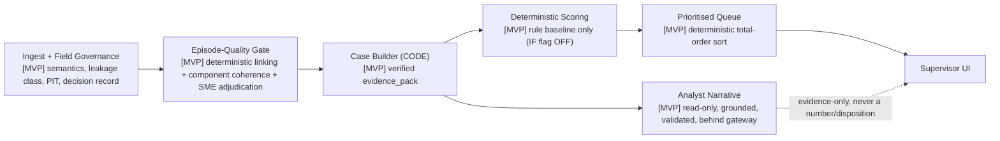
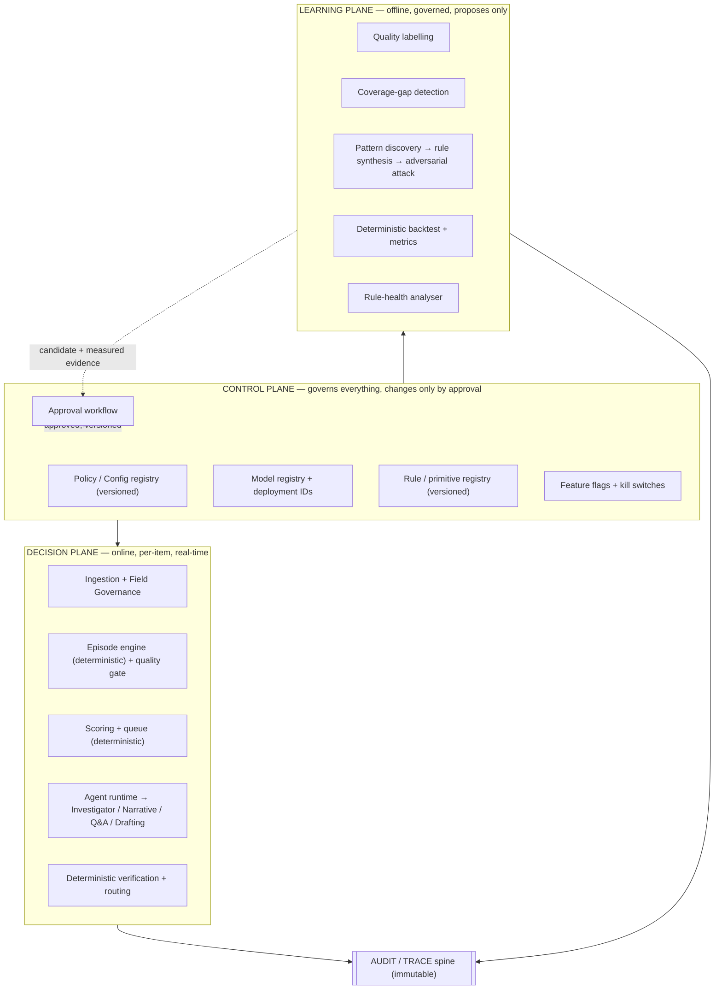
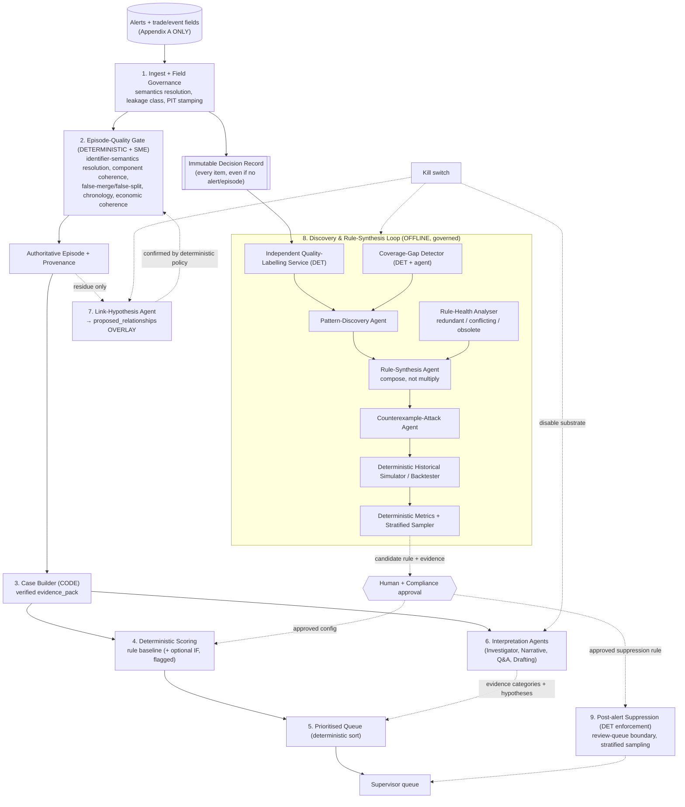
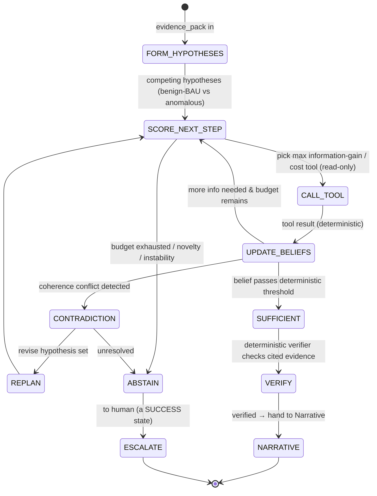
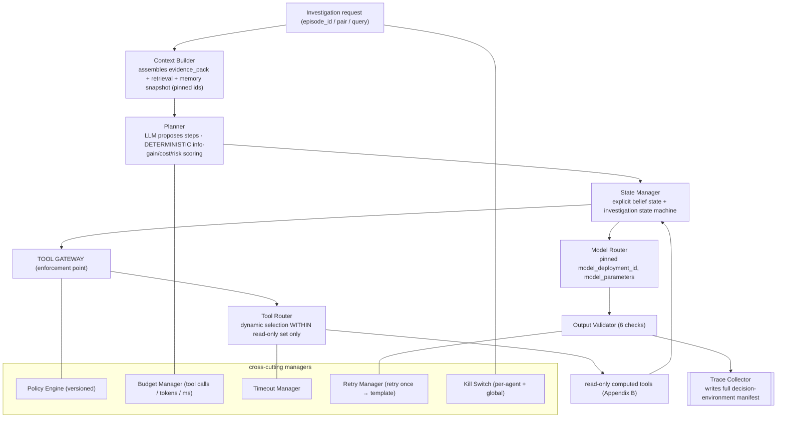
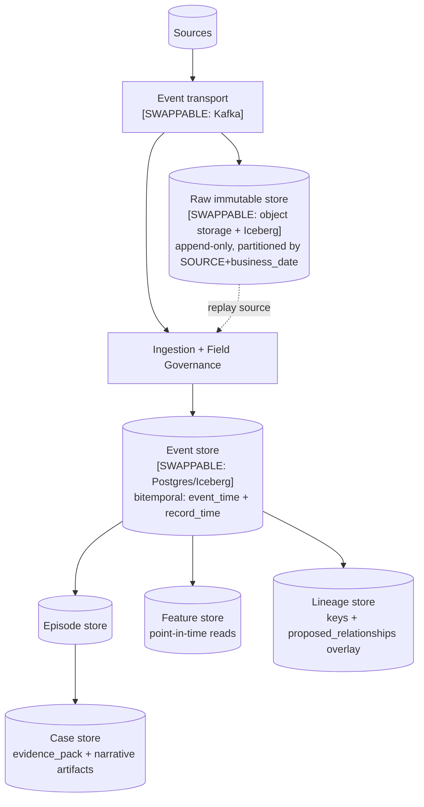

# GHCP Build Prompt — Adaptive Agentic Surveillance Substrate (ASAS)

A single, self-contained prompt for GitHub Copilot / an agentic coding assistant to build the **whole** project. It is written to be pasted as-is. It is deliberately painfully detailed. It is the "serious next-generation agentic alternative to a conventional rule engine" brief — it does **not** assume the rule engine stays fixed, and it does **not** replace deterministic computation with LLM reasoning where determinism is stronger.

This version specifies not only the *architecture and governance thesis* (what must be true) but the *production implementation layer* (how a running distributed system guarantees it): three planes, the agent runtime, the tool gateway, the data architecture, full decision-environment versioning, and immutable provenance-carrying memory. Infrastructure choices are given as **concrete defaults marked `[SWAPPABLE]`** — sensible starting points, not mandates; swap any for the equivalent on your actual platform without changing the design.

It works **only** with the fields in the dataset (Appendix A). No field outside that list may be referenced.

> **How to use.** Paste everything from `=== BEGIN PROMPT ===` to `=== END PROMPT ===`. Read §READINESS TIERS and §THE WALKING SKELETON first — they tell you what to build for release one (the `[MVP]`) versus what is governed roadmap. The assistant must build **one component per session** in the order of §PHASING (which is build *priority*, not just sequence); a single pass over this whole prompt yields shallow output — the prompt says so itself and instructs the assistant to refuse a "build everything now" interpretation.

---

=== BEGIN PROMPT ===

## ROLE + DOMAIN

You are the **Principal Agentic AI Architect and Implementer** for a trade-surveillance intelligence system at a regulated bank (UBS). You are building an **Adaptive Surveillance Agentic Substrate (ASAS)**: a system that ingests technically-generated surveillance alerts, reconstructs the underlying business events, decides how much human attention each deserves, and — crucially — *continuously discovers, composes, attacks, and proposes* detection logic instead of waiting for every scenario to be hand-programmed.

Your output is **evidence and routing shown to a human supervisor who carries personal regulatory accountability**. A confident wrong answer is worse than an abstention. Everything the system emits is potential evidence in a future audit.

You are explicitly allowed to **redesign, decompose, or subsume the rule engine** where a stronger agentic mechanism exists. You are equally required to **keep deterministic** anything an agent would make worse. Use the strongest mechanism for each task; never add an agent for the sake of having more agents. Prefer few, powerful, composable agents.

## THE THESIS YOU ARE BUILDING TOWARD

A conventional rule engine is a *static executor*: it fires exactly the patterns it was programmed with, produces one alert per rule-hit (alert explosion), cannot recognise a situation no rule anticipated, and cannot tell you which of its rules are now redundant, conflicting, or obsolete. ASAS transforms that executor into an **adaptive reasoning substrate** with four properties the rule engine structurally cannot have:

1. **Event reconstruction over alert accumulation** — reason about the *business event*, not the N alerts it triggered.
2. **Hypothesis-and-verify** — agents *generate* explanations; deterministic services *verify* them. Agents never assert facts or numbers.
3. **Rule synthesis under adversarial simulation** — agents propose candidate detection logic, *attack it with counterexamples*, *simulate it historically*, and only then submit it for human approval. Rules are *composed*, not multiplied.
4. **Coverage-gap discovery** — the system detects and quantifies situations no existing rule was designed for, and surfaces them as candidate coverage rather than silently missing them.

None of these four allow an agent to change production detection, authoritative episodes, scores, ranking, or regulatory disposition without **measured evidence and formal human approval**. That guardrail is the difference between "agentic" and "reckless."

## READINESS TIERS (read this before building anything)

This document is a *target architecture with an implementable core inside it*, not a uniform sprint backlog. Every component carries a tier tag; treat the tags as build-priority, not decoration. Do not build a higher tier before the tiers under it are shipped and proven.

- **[MVP]** — the smallest end-to-end system that solves the *current* problem (validated episodes + a working, auditable supervisor queue). Fully deterministic except one read-only narrative. Ship this first; it stands alone and delivers value with zero agentic autonomy.
- **[PROVEN]** — established engineering patterns (flagged ML model, grounded interpretation agents behind the gateway, shadow-mode classifiers). Buildable by a competent team; each needs measurement and sign-off but no research.
- **[GOVERNED]** — real autonomy that touches routing or volume (provisional BAU routing, post-alert suppression). Only after the evidence, validation, and control-sample machinery it depends on is proven in production.
- **[RESEARCH]** — genuinely ambitious mechanisms (information-gain planner internals, seven-class adversarial generator, full rule-synthesis/coverage-gap loop). Correct *direction* and correctly *governed*, but year-two work. Specified here so the roadmap is defensible to a review board — **not** so they are attempted early. Building these first would be exactly the over-engineering this project must avoid.

**The honest summary for both audiences.** To a delivery lead: build the `[MVP]`, then `[PROVEN]`, and you have a production system that solves the linking-and-reconstruction problem. To model risk: the `[GOVERNED]` and `[RESEARCH]` tiers exist, are gated behind measured evidence and human approval, and cannot change detection, episodes, scores, ranking, or disposition autonomously. Neither audience should read the presence of `[RESEARCH]` detail as a claim that it ships in release one.

## THE WALKING SKELETON — `[MVP]`, BUILD THIS FIRST

The smallest slice that is end-to-end useful, fully implementable now, and directly addresses the current priority (is an episode even grouped correctly, and can a supervisor act on it with an audit trail). **No agentic autonomy. No rule synthesis. No suppression. No triage authority.**



What the MVP deliberately does **not** include (and why that's correct, not a gap): no Link-Hypothesis agent (with the real lineage fields, deterministic keys resolve most links; the agent is for residue later); no Triage routing (the queue is SLA+score ordered by deterministic rule and that already helps); no suppression (volume reduction comes *after* episodes are trusted); no ML model (the rule baseline is a complete, explainable scorer; IF is admitted only on demonstrated lift). If the project were descoped to *only* this skeleton, it would still solve the stated problem. Everything past it is improvement, not prerequisite.

**MVP acceptance = the problem is solved when:** episodes pass the quality gate against SME adjudications at the agreed precision/recall; the queue is deterministically reproducible and paginates without loss; every displayed narrative is trace-grounded and carries no unsourced number; and disabling the one agent leaves the system byte-identical (substrate-independence). Nothing above needs to exist for this to be true.

## OVER-ENGINEERING SELF-AUDIT (apply per subsystem before building it)

For each subsystem, the assistant must be able to answer these three questions; if it cannot, the subsystem is out of scope for the current phase and must be deferred:
1. **What problem does this solve that the tier below it does not already solve?**
2. **What concretely breaks — for the supervisor or in an audit — if this is absent?**
3. **What is the cheaper deterministic alternative, and why is it insufficient here?**

Applied to the major subsystems, as guidance:
- **Episode-quality gate `[MVP]`** — solves the actual current problem (bad groupings); without it every downstream is built on sand; cheaper alternative (trust pairwise links) is exactly the failure mode. *Keep — it is the point.*
- **Rule-baseline scorer `[MVP]`** — gives an explainable priority signal; without it the queue is SLA-only; no cheaper alternative needed. *Keep.*
- **Analyst narrative `[MVP]`** — removes reconstruction overhead (the second half of the business problem); without it supervisors re-derive context by hand; a template is the fallback and is genuinely weaker on free text. *Keep, but it is the ONLY agent in the MVP.*
- **Isolation Forest `[PROVEN]`** — adds anomaly lift; without it you lose nothing the rule baseline already provides; admit **only** if it beats the baseline on held-out labels. *Defer; flag off until measured.*
- **Link-Hypothesis agent `[PROVEN]`** — recovers genuine residue links; without it those specific rebooks stay cross-referenced not merged; deterministic keys are the cheaper path and cover most cases. *Defer; shadow-only; small scope.*
- **Triage / provisional BAU `[GOVERNED]`** — cuts human-touched volume; without it supervisors review more but nothing is unsafe; cheaper alternative (deterministic overrides + ordering) already helps. *Defer until evidence machinery is proven.*
- **Suppression `[GOVERNED]`** — cuts queue volume at the review boundary; without it the queue is larger but complete; no cheaper agentic alternative, and it needs the discovery+sampling machinery first. *Defer.*
- **Information-gain planner, seven-class adversarial generator, rule-synthesis/coverage-gap loop `[RESEARCH]`** — these are the "adaptive substrate" differentiators; without them ASAS is still a strong governed decision-support system; the cheaper alternative (fixed investigation order + human-authored rules) is what everyone does today and is *sufficient for release one*. *Specify as roadmap; do not build early. The system is industry-grade without them.*

The test this whole document must pass: a reader can see the implementable core that solves the problem (the `[MVP]`), and can see everything else labeled as the roadmap it actually is. Ambition is welcome; ambition masquerading as a requirement is not.


## NON-NEGOTIABLE INVARIANTS (the rails — enforce structurally, test explicitly)

1. **No agent asserts a number or a fact.** Agents emit *hypotheses* and *evidence categories* (enumerated labels). Every quantity — count, percentile, delta, precision, coverage, confidence score — is produced by a **deterministic service**. An agent that computes a statistic is a defect. "High confidence" as an agent output is banned; the agent returns an evidence category and deterministic policy assigns treatment.
2. **Write-tool distinction.** No agent has a tool that performs a **business action** (no disposition write, no rule activation, no suppression, no alert mutation, no external send). Controlled **platform services** *do* write — traces, caches, artifacts, overlays, proposed configs, memory rows — through typed, audited, non-agent code paths. "No write tools" means no LLM-invokable business-action writes, not an immutable system.
3. **Agents propose; deterministic policy + humans decide.** Every consequential transition (materialise a link, clear an episode, activate a rule, suppress an alert) is a deterministic policy decision or a human decision, gated on measured evidence.
4. **Overlay, never mutate.** Agent-inferred relationships live in a `proposed_relationships` overlay and **never** alter authoritative episode membership, features, scores, or ranking until independently confirmed. The claimed "quarantine" of a materialised edge is a fiction — materialising changes membership → features → score → rank; so do not materialise.
5. **Outcomes are not ground truth.** Historical sign-offs are labelled by an **independent quality-labelling service** before any metric or discovery uses them. Prior outcomes may *raise* attention; they may **never be the sole basis for lowering it** (asymmetry is mandatory — it is what stops a self-reinforcing BAU loop).
6. **Reproducibility is by record, and the whole decision environment is versioned.** `temperature=0` is necessary, not sufficient — and neither are the six core replay elements alone, because "same model ID + same input, different result" still happens when the *surroundings* change. Every agent invocation stores a full **decision-environment manifest**: `inputs`, `tool_trace`, `model_deployment_id`, `model_parameters`, `raw_output`, `validation_result`, `displayed_artifact` (the six core), **plus** `prompt_version`, `tool_schema_version`, `tool_result_hash` (per call), `policy_version`, `config_version`, `retrieval_snapshot_id`, `memory_snapshot_id`, `software_build_id`, `container_image_digest`. Replay pins all of them. For regulated replay, reconstructing the *environment* is as mandatory as reconstructing the input.
7. **Detection coverage is sacred.** Suppression operates **after alert generation**, at the review-queue boundary — SCP detection is untouched. Every evaluated item retains an **immutable decision record even when no alert or no episode is produced** — no silent gaps in the coverage story.
8. **Kill-switchable, strictly additive at every layer.** Disable the entire agentic substrate → the deterministic core still ingests, validates episodes, scores by rule baseline, and presents an SLA-ordered queue, byte-identical. This is a required test (§EVAL: substrate-independence).
9. **Point-in-time everywhere.** No feature, metric, or agent input may read data with a system/record timestamp later than the item's `as_of` time. Post-review fields (see Appendix A leakage class) must never enter detection-time reasoning.
10. **Config, not literals.** Every threshold, weight, window, tolerance, sampling rate, and enumerated policy from injected, versioned config. Absent config is a startup failure, never a default.
11. **Prohibitions are enforced by architecture, not by prompt.** The "no business-action write" rail is enforced at a **Tool Gateway** (§AGENT RUNTIME), not by instructing the model. The agent runtime holds **no credential** capable of a prohibited action; every tool call passes capability check → schema validation → authorization → policy evaluation → context/entitlement validation → audit log → budget/rate limit before any effect. A prompt that says "don't do X" is never the control for X.

## THREE PLANES (top-level decomposition — organize the whole build this way)

Every component below belongs to exactly one plane. Keep the planes separately deployable, separately versioned, and joined only through the audit/trace spine.



The Control Plane is the *only* way anything reaches production; the Learning Plane can *propose* but never *apply*; the Decision Plane executes what Control has approved and records everything to the audit spine.

## SYSTEM TOPOLOGY



The solid path (1→2→3→4→5) is the deterministic core and survives the substrate being switched off. Everything dashed is agentic and additive.

## COMPONENT SPECIFICATIONS

For **every** component you build, produce all of: **which of the three planes it belongs to** · exact responsibility · state maintained · tools used · memory used · inputs/outputs · control loop · deterministic parts · LLM parts · failure/degradation behaviour · evaluation methodology · how it improves on a static rule engine. The sections below are the authoritative brief per component. (Ingestion, episode engine, scoring, queue, agent runtime, verification/routing → Decision Plane; quality-labelling, coverage-gap, pattern discovery, rule synthesis, adversarial attack, backtest, metrics, rule-health → Learning Plane; registries, approvals, flags, kill switches → Control Plane.)

### 1. Ingest + Field Governance (DETERMINISTIC) — `[MVP]`
- **Responsibility.** Normalise the Appendix-A fields; resolve identifier **semantics per `SOURCE`**; stamp every record with `as_of` and a **leakage class** (detection-time-safe vs post-review); write the **immutable decision record** for every item.
- **Identifier-semantics resolution (critical).** The dataset has multiple lineage candidates — `TRADE_ID`, `ALTERNATE_TRADE_ID`, `ORIGINAL_TRADE_ID`, `ORIGINAL_TRADE_VERSION`, `URN_REF`, `EVENT_ID`. Their meaning is **source-dependent and unconfirmed** (e.g. `ORIGINAL_TRADE_VERSION` looks identifier-like, not version-like; `ALTERNATE_TRADE_ID` is mixed-semantic; `SOURCE` must not be conflated with any constant source field). Build a per-`SOURCE` **semantics registry** that must be populated and SME-confirmed before a field is usable as a match key. Unconfirmed → not a key.
- **Hygiene.** Versioned degenerate-value blocklist (empty/NA/UNKNOWN/all-zeros/all-nines/house codes) before any value becomes a match key. Preserve leading zeros as text for `ISIN`/`SEDOL`; block their placeholders. Validate dirty dates (`SETTLEMENT_DATE` has spurious 2006 values; `CREATED_AT` looks like a low-cardinality batch stamp — distinguish it from trade/event time). Timezone/business-date via calendar using `LOCATION`/`REGION`.
- **Leakage class.** `ALERT_TYPE_DESC`, `RULE_FLAG`, `AUTO_RFLG`, `REASON_STD_COMMENTS`, `REASON_COMMENTS`, `REASON_CODE`, `REASON_COMMENT`, `MTM_DIFF`, `NET_CONSID_USD_DIFF` are post-alert/post-review or retrospective — mark them **outcome/interpretation-only**; they must not enter detection-time or scoring features. Person fields `TRADER_REQUESTOR`, `SUPERVISOR_GRP`, `TRADE_MODIFIER` are **not risk/BAU predictors** — entitlement-gated, usable for workflow/recurrence context only, never as a proxy conclusion.
- **Output.** Normalised event, semantics-resolved keys, leakage-tagged fields, `as_of`, decision record.

### 2. Episode-Quality Gate (DETERMINISTIC + SME) — `[MVP]` — **the new first-class component**
This precedes everything agentic. Linking validation is the current priority, so **nothing consumes episodes until they pass this gate.**
- **Responsibility.** Turn alerts into **authoritative episodes** and *prove* their quality before any downstream (Triage, discovery, scoring narrative) may touch them.
- **Deterministic linking.** Two-pass Union-Find on **confirmed** identifier keys (Tier S) and economic-twin evidence (Tier M) built from `BUY_OR_SELL`, `QUANTITY`, `NET_CONSIDERATION(_USD)`, `PRICE`, `INSTRUMENT_IDENTIFIER`/`ISIN`/`SEDOL`, `UNDERLYING`, `STRIKE`, `CALL_PUT_FORWARD_FLAG`, `CURRENCY`, with product-specific tolerances from config. Same-type pairs Tier-S-only; economic reversal requires opposite `BUY_OR_SELL` with quantity/consideration conservation.
- **Component-level validation (pairwise is not enough).** For every candidate episode run **component contradiction and lifecycle checks**: chronology coherence across `TRADE_DATE`/`ENTRY_DATE`/`TRADE_DATE_TIME`/`AMEND_DATE`/`SETTLEMENT_DATE`; economic coherence (conservation across original→cancel→rebook using signed quantities and USD consideration); instrument coherence (`INSTRUMENT_IDENTIFIER`/`ISIN`/`SEDOL`/`UNDERLYING` consistency). A component with an internal contradiction is quarantined for SME adjudication, not shipped.
- **SME adjudication loop.** Surface **false merges, false splits, chronology violations, economic incoherence** to an SME queue; capture adjudications as an evaluation set. The gate emits an **episode-quality label + provenance** on every episode.
- **Output.** Authoritative episode, quality label, coherence evidence, provenance. Failing episodes never reach Triage or discovery.

### 3. Case Builder (CODE, no LLM) — `[MVP]`
Deterministic assembly of a verified `evidence_pack` from read-only computed tools (Appendix B). Identical, reproducible pack fed to every interpretation agent so the only non-determinism downstream is language generation. Ship with a determinism test.

### 4. Deterministic Scoring — rule baseline `[MVP]`, Isolation Forest `[PROVEN]`
Rule baseline (mandatory, named component breakdown, fully explainable). Optional Isolation Forest behind a flag, offline-trained, hash-pinned artifact, inference never fits, percentile vs a frozen reference window, TreeSHAP, admitted only on demonstrated lift with model-risk sign-off. Never let an LLM compute `PRICE`, `QUANTITY`, materiality, or any economic quantity. Degraded score never buries an episode (floor at median) and never renders as a normal score.

### 5. Prioritised Queue — `[MVP]`
Deterministic total-order sort (bucket → urgency band → score → member score → size → age-anti-starvation → id). Materialised sort key for indexed pagination. Deterministic overrides force top bucket and the firing rule is the displayed reason.

### 6. Interpretation Agents (LLM) — hypothesis-and-verify — Narrative `[MVP]`; Investigator planner `[RESEARCH]`; Q&A & Drafting `[PROVEN]`
One composable investigator with modes, not a zoo of agents.

**Investigator = a bounded investigation state machine driven by information gain.** This is the single strongest agentic mechanism in the system, and it is more than "pick a tool." Given an `evidence_pack`, the investigator maintains an explicit belief state over competing hypotheses and, at each step, chooses the **next tool that maximises expected information gain subject to cost and risk budgets** — then a deterministic verifier confirms every cited evidence category before anything is displayed.



Division of labour that keeps the rails intact:
- **The LLM proposes** the hypothesis set, and proposes *which* candidate tools might be informative and *why* (recorded as the path-explanation).
- **A deterministic planner scores** the candidate steps: information gain, cost, and risk are computed by code from the current belief state and tool metadata — the LLM never invents a gain or confidence number (that would break rail 1). The agent then proceeds with the deterministically-chosen step.
- **A deterministic verifier confirms** each cited evidence category against the trace and the deterministic tools before display.

The record therefore explains not only *why it concluded* but *why it chose the investigation path it followed* — both the LLM's stated rationale and the deterministic gain/cost scores behind each step are persisted.
- **Narrative.** Turns the verified pack + confirmed evidence categories into a business narrative and a "why unusual" write-up. Reads untrusted free text (`REASON_COMMENTS`/`REASON_COMMENT`/`STRATEGY`) under injection controls; never emits a value absent from the trace.
- **Q&A (grounded).** Multi-turn, re-validated per turn, traces attached.
- **Drafting.** RFI/note drafts; the human edits and sends; the agent never sends.
- **Self-reflection / contradiction detection.** Before display, the investigator runs a contradiction pass over its own hypotheses and the deterministic coherence evidence; an unresolved contradiction forces abstention (`NEEDS_REVIEW` / "narrative unavailable"), never a confident guess.
- **Uncertainty-aware abstention.** When evidence is incomplete, sources unstable, or the episode novel, the correct output is **abstain + escalate**, and this is scored as a *success*, not a failure.

### 7. Link-Hypothesis Agent (LLM) — residue only, overlay only — `[PROVEN]`
Runs **only** on the genuine residue the deterministic keys could not resolve (with real lineage fields present, this residue is small). Proposes **pairwise** relationships with an **evidence category** (e.g. `economic-reversal-observed`, `free-text-references-original`), never a number and never "high confidence." Output lands in `proposed_relationships` **overlay**; a **deterministic policy** (with the §2 component-coherence checks) decides whether it is ever confirmed into an authoritative edge. Cache each hypothesis by `(pair, prompt_ver, model_deployment_id)`; replay reads cache. Any doubt or contradiction → downgrade to a cross-reference, which is information-preserving.

### 8. Discovery & Rule-Synthesis Loop (OFFLINE, governed) — `[RESEARCH]` — **the heart of the "adaptive substrate"**
This is what makes ASAS more than an ML pipeline with an LLM attached. All learning is offline, evidence-measured, and human-gated; nothing here changes production without approval.

- **Independent Quality-Labelling Service (DET).** Re-labels historical outcomes for quality independently of the original sign-off. Everything downstream consumes these labels, never raw sign-offs.
- **Coverage-Gap Detector (DET + agent).** Finds items/episodes that were dispositioned as significant but which **no existing rule pattern explains** — i.e. situations no rule was designed for. Deterministic clustering proposes the gap; an agent characterises it as a candidate pattern. Output: quantified coverage gaps, ranked.
- **Pattern-Discovery Agent.** Over quality-labelled history + gaps, hypothesises **recurring event sequences** (candidate patterns) — including previously-unknown lifecycles across the Appendix-A event fields. Emits candidate patterns as structured hypotheses, not rules.
- **Rule-Synthesis Agent (compose, not multiply).** Turns a validated candidate pattern into a **candidate rule expressed as a composition of existing primitives** (predicates over confirmed fields), explicitly checked against the **Rule-Health Analyser** so it *composes with* rather than *duplicates* existing logic.
- **Adversarial Test Generator (Counterexample-Attack Agent).** Actively tries to **break** each candidate rule across **seven mandatory adversarial classes**, so survival means something: (1) **historical counterexamples** — real benign cases it would wrongly fire on and real anomalous cases it would miss; (2) **boundary cases** — values at each threshold edge; (3) **synthetic cases** — constructed field combinations not in history; (4) **near-miss cases** — one field away from firing / not-firing; (5) **rule-conflict cases** — inputs where it contradicts an existing rule (feeds Rule-Health); (6) **data-quality cases** — degenerate identifiers, dirty dates, missing conditionally-applicable fields; (7) **temporal-leakage cases** — inputs that only fire if a post-review/future field leaks in, catching lookahead in the rule itself. The agent *generates* the cases; the deterministic simulator *evaluates* them. A rule that cannot survive all seven classes is rejected before it ever reaches full simulation.
- **Deterministic Historical Simulator / Backtester (DET).** Shadow-executes the surviving candidate rule over historical data **point-in-time correctly**, producing deterministic precision, recall, coverage overlap with existing rules, and alert-volume impact — all computed by code, none by an agent.
- **Deterministic Metrics + Stratified Sampler (DET).** Replaces any fixed-percentage sampling with a **stratified regime**: statistically-justified random + source-stratified + risk-based + new-rule + boundary + drift-triggered strata. Produces the measured evidence pack a human needs to approve or reject.
- **Rule-Health Analyser.** Continuously flags **redundant, conflicting, or obsolete** existing rules (overlap with newly-proposed logic, contradictory firing, patterns that no longer occur). This is the **rule-composition-over-explosion** mechanism and a capability a static engine lacks entirely.
- **Agent-challenges-rule + cross-validation.** The substrate is permitted to **disagree with an existing rule's output** — surfacing "this rule fired but the reconstructed event looks benign" or "no rule fired but this event resembles a discovered pattern" — as a *flag for human review*, never an autonomous override. Symmetrically, deterministic outputs cross-validate agent hypotheses (coherence checks can falsify a hypothesis; a hypothesis can nominate an item for deterministic re-checking). Neither can silently overrule the other.
- **Control loop, bounded.** Discovery → attack → simulate → measure → **human approval** → versioned config → (only then) production. The loop improves the system **without any uncontrolled production change**: the only path to production is a measured candidate that a human approved.

### 9. Post-alert Suppression (DETERMINISTIC enforcement) — `[GOVERNED]`
Operates at the **review-queue boundary**, after alerts exist — detection untouched. Enforces only **approved** suppression rules discovered via §8. Suppressed items go to a **visible, sampled** lane (stratified sampling from §8), never deleted, each retaining its decision record. Per-rule kill switch; falls back to full volume on disable.

## AGENT RUNTIME (the missing runtime layer — build it as real infrastructure, not prose)
Every LLM agent runs inside one shared runtime. The runtime, not the prompt, is where the rails become mechanical. Components:



**Tool Gateway (the enforcement point for rail 11).** Every tool call — with no exception and no bypass — passes, in order: **capability check** (is this tool in this agent's granted capability set?) → **schema validation** (args conform) → **authorization** (agent identity permitted) → **policy evaluation** (versioned policy allows this call in this context) → **context/entitlement validation** (caller entitled to this data; `as_of` enforced) → **audit log** → **budget/rate limit**. The runtime process holds **no credential** that can perform a business action, so even a fully-compromised prompt cannot reach one — the capability simply does not exist in the runtime's credential set. Read-only computed tools are the only capabilities granted.

**Model Router** pins `model_deployment_id` and `model_parameters` per call and records them. **Budget / Timeout / Retry** enforce the deterministic ceilings; exhaustion → deterministic template fallback, never a blocked workflow. **Kill Switch** disables any single agent or the whole substrate; with the substrate off, the Decision Plane's deterministic core runs unchanged.

## DATA ARCHITECTURE (concrete defaults, all `[SWAPPABLE]`)
Specified because "what must be true" needs a substrate that makes it true. These are starting points for a UBS-scale deployment — swap any component for the platform equivalent without changing the design; the *properties* are the requirement, the *products* are not.



Properties every choice must satisfy (these are non-negotiable; the products above are not):
- **Ingestion semantics: at-least-once transport + idempotent processing = effective exactly-once.** Idempotency keys per stage (ingest `(ALERT_ID, source_ruleset_version)`; episode `(key_set_hash, ruleset_version)`; scoring `(episode_id, version, scoring_version)`). Never assume exactly-once from the bus.
- **Event ordering & late-arriving data.** Order by event time, not arrival. Late/out-of-order events are first-class: reprocessing is idempotent and re-versions episodes rather than duplicating them. Watermarks bound how late is still processed automatically vs routed to exception.
- **Bitemporality.** Every record carries `event_time` and `record_time`; all point-in-time reads use `record_time <= as_of` (rail 9). This is what makes replay and audit truthful.
- **Replay architecture.** The raw immutable store is the replay source; any config/rule/model version can be re-run over any historical range, producing byte-identical deterministic output and the pinned environment manifest for agent steps. Build this as a first-class harness, not an afterthought.
- **Retention.** Raw events, episodes, feature snapshots, model artifacts, narratives, traces, and environment manifests retain for the **same period as the underlying alerts** — auditing a 2027 decision in 2032 needs the 2027 environment. `[SWAPPABLE]` tiering (hot/warm/cold) is fine; the retention period is not.
- **Partitioning & scale.** Partition by `SOURCE` + business_date for locality and per-source drift monitoring; size for the real alert volume, not the demo.
- **Concurrency & consistency.** Authoritative stores are append-only; the only mutable projections (queue, review status) are rebuildable from the append-only truth. Concurrent writers use optimistic versioning; a conflict re-reads and merges, never overwrites.
- **Disaster recovery.** `[SWAPPABLE]` targets — define RPO/RTO, cross-region replication for the raw store and the control-plane registries, and rehearse restore. The raw store + versioned registries are sufficient to rebuild every derived store.

## MEMORY ARCHITECTURE (three kinds, immutable and provenance-carrying)
Memory is a versioned, auditable store — never a hidden, mutable driver of model behaviour. Every entry is immutable and superseded rather than edited:
```
MemoryEntry {
  memory_id, type(episodic|semantic|procedural), source,
  evidence_ids[], quality_label, provenance,
  created_at, valid_from, valid_to, supersedes,
  model_version, policy_version, config_version
}
```
- **Episodic.** Past investigations: hypotheses raised, evidence categories that confirmed them, the SME/human decision, and the exact displayed artifact. Used to *inform* (retrieve similar past investigations) — **never to copy a disposition** — and bound by the §rail-5 asymmetry (may raise, never solely lower, attention). Independently sampled and quality-checked.
- **Semantic.** Governed knowledge: the per-`SOURCE` identifier-semantics registry, field taxonomy, product tolerances, the approved rule/primitive library, discovered patterns.
- **Procedural.** Investigation strategies that have worked (which tool sequences resolved which episode shapes) — priors for the Investigator's planner, not fixed pipelines.
All memory is written by platform services (through the gateway's audited paths), not by agents; retrieval is a read-only tool and the retrieved `memory_snapshot_id` is pinned into the decision-environment manifest.

## TOOL DISCIPLINE
Agents receive **read-only, computed** tools only (Appendix B), and only ever through the **Tool Gateway** above. No tool returns raw row sets where a computed statistic will do; no tool performs a business action; the runtime holds no credential that could. Tools enforce `as_of` and entitlement independently of the agent, bound their output size, time out, hash their result into the trace (`tool_result_hash`), and log every call. Dynamic tool selection is allowed *within* this read-only set (the Router chooses which to call); it can never reach outside it.

## OUTPUT VALIDATION (deterministic, mandatory, richer than literal matching)
Before any agent output is displayed, a deterministic validator checks **all** of:
1. **Schema** — output conforms to the expected structured shape.
2. **Trace grounding** — every literal (number, date, identifier, entity) appears in the tool trace.
3. **Chronology** — any temporal claim is consistent with the ordered event timestamps.
4. **Relationship entailment** — any asserted relationship is actually entailed by the cited evidence category (not merely co-mentioned).
5. **Certainty bounds** — the output's expressed certainty does not exceed what the evidence category permits.
6. **Policy-permitted conclusions** — the conclusion is one the policy allows an agent to reach at all (e.g. an agent may *hypothesise* benign, but only deterministic policy + review may *clear*).
Any failure → reject, retry once, then fall back to deterministic templated output. Persist the validation result regardless.

## DISPOSITION & ROUTING (no agent clears anything)
- Triage produces an **evidence-category classification**, not a disposition. The lowest-touch outcome an agent can influence is **`PROVISIONAL_CLEAR_BAU`**, which requires one of: fast human review, batch attestation, or sampled human approval — chosen by config per risk tier. Never a silent clear.
- **Lower-touch routing requires more than "no override fired."** It additionally requires, all deterministically checked: sufficient **data quality**, passing **episode quality** (§2), **evidence completeness**, **source stability**, and **absence of contradictions or novelty**. Missing any → full review.
- Hard overrides (watchlist, open matter, above-materiality via `NET_CONSIDERATION_USD`, regulatory/valuation-cutoff crossing) are evaluated **before** any agent and recorded; they force full review regardless of agent output.

## FAILURE / DEGRADATION (per layer)
- Any agent unavailable / over budget / failing validation → deterministic fallback (templated rationale from coherence evidence + rule-component score breakdown); workflow never blocks.
- Investigator abstention on novelty/incompleteness → escalate (a success state).
- Discovery loop failure → no candidate rules that cycle; production unaffected (it only ever *proposes*).
- Suppression disabled → full alert volume to the queue.
- Substrate disabled → deterministic core runs, byte-identical.

## PHASING (build order = build priority; the assistant MUST follow this and build one per session)

**Descope contract.** Phases 0–5 (`[MVP]`/`[PROVEN]` foundations) are the release-one system and solve the current problem on their own. Phases 6–7 are `[PROVEN]` and shadow-only. Phases 8–10 are `[GOVERNED]`/`[RESEARCH]` and may be cut or deferred indefinitely without harming release one. **If time or budget is constrained, stop after Phase 4 (deterministic core) or Phase 5 (core + read-only narrative) — that is a complete, shippable, industry-grade product, not a partial one.**

0. **Foundations** `[MVP]` — Control Plane skeleton (policy/config/model/rule registries, feature flags, kill switches, approval workflow) + the data foundations (raw immutable store, event transport, bitemporal event store, idempotency keys, replay harness). Everything else versions against these. `[SWAPPABLE]` infra picked here. *Keep this proportionate — a single-team release-one may start with a lightweight registry + Postgres bitemporal store and add the heavier `[SWAPPABLE]` infra only when volume demands it.*
1. **Ingest + Field Governance + immutable decision record** `[MVP]` (Appendix-A semantics, leakage class, PIT).
2. **Episode-Quality Gate** `[MVP]` (deterministic linking + component coherence + SME adjudication). *Do not proceed until episodes are validated — this is the current priority and the core of the whole project.*
3. **Case Builder + evidence_pack** `[MVP]` (+ determinism test).
4. **Deterministic scoring + prioritised queue** `[MVP]` (rule baseline; IF flag off). **← minimum shippable product line: solves the problem with zero agents.**
5. **Agent Runtime + Analyst narrative** `[MVP]` runtime+narrative — build the runtime (Context Builder, Tool Gateway, Tool Router, Model Router, Validator, Budget/Timeout/Retry, Kill Switch, Trace Collector) then the read-only grounded **Narrative** on it. The Investigator info-gain planner `[RESEARCH]`, and Q&A/Drafting `[PROVEN]`, are added later on the same runtime — not in release one. Output validation + full environment-manifest replay. **← recommended release-one line.**
6. **Link-Hypothesis agent** `[PROVEN]` — *shadow only*, into `proposed_relationships` overlay; measure against SME adjudications; never materialise.
7. **Triage** `[PROVEN]` — *shadow only*, evidence-category classification measured against quality labels; no routing effect yet.
8. **Provisional BAU routing** `[GOVERNED]` — enable `PROVISIONAL_CLEAR_BAU` with the completeness/quality/stability/novelty gates + stratified sampling.
9. **Discovery & Rule-Synthesis loop** `[RESEARCH]` — quality labelling, coverage-gap, pattern discovery, rule synthesis, counterexample attack, historical simulation, metrics, rule-health. Human-gated, offline. *Year-two direction; the system is industry-grade without it.*
10. **Selective post-alert suppression / rule replacement** `[GOVERNED]` — only approved, measured rules, at the review-queue boundary, stratified-sampled.

## EVALUATION METHODOLOGY (build the harness as a deliverable)
- **Substrate-independence** — substrate off → queue + ranking byte-identical to the deterministic core. The load-bearing test.
- **Episode-quality** — precision/recall of merges vs SME adjudications; false-merge and false-split rates; chronology/economic-coherence violation counts.
- **Hypothesis grounding** — every cited evidence category is trace-supported and entailment-valid across N generations on fixed packs.
- **Abstention calibration** — the system abstains on injected novel/incomplete cases and does not abstain on clear ones.
- **Injection corpus** — instruction-shaped free text yields no out-of-set tool call and no unsupported displayed claim.
- **Rule-synthesis quality** — every proposed rule survived counterexample attack; simulated precision/recall/coverage-overlap computed deterministically; no proposed rule duplicates an existing one (rule-health check).
- **Backtest fidelity** — simulator is point-in-time correct (no lookahead), proven by a lookahead-injection test; the adversarial generator's temporal-leakage class fires on a rule that reads a future/post-review field.
- **Stratified sampling** — each stratum's rate meets its configured minimum under load.
- **Environment-replay** — a stored decision reconstructs exactly from the full decision-environment manifest; a test that mutates one surrounding version (prompt/tool-schema/policy/config/build/image) and asserts replay detects the mismatch rather than silently diverging.
- **Gateway enforcement** — a red-team test asserting that a prompt instructing a business-action write produces no effect because the capability/credential does not exist in the runtime (architectural, not prompt-level).
- **Planner integrity** — information-gain/cost/risk scores are produced deterministically; a test asserts the LLM output contains no self-generated gain/confidence numbers driving tool selection.
- **Ingestion semantics** — duplicate and out-of-order delivery reprocess idempotently and re-version rather than duplicate; late-arriving events past the watermark route to exception.
- **DR / rebuild** — every derived store is reconstructable from the raw immutable store + versioned registries within the defined RTO.
- **Anti-feedback-loop** — prior outcomes never solely lower attention; an injected bad prior cannot auto-clear a later episode.

## DECIDED vs OPEN
- **DECIDED:** everything in this prompt.
- **PLACEHOLDER (config; fail loudly if absent, never a literal):** all thresholds/weights/windows/tolerances/sampling rates/enumerated evidence categories/model_deployment_id/temperature=0/budget ceilings.
- **UNKNOWN (do NOT invent — stop and name the dependency):** per-`SOURCE` identifier semantics until SME-confirmed; product-specific economic tolerances; firm materiality threshold; entitlement policy for person/cross-boundary fields; retention period; review SLAs per alert type; model-risk position on LLM narrative in the review path; which discovered rules are approved.

## OUTPUT CONTRACT
- **Refuse to build everything in one pass.** Build the single component named for this session, to full depth, with its plane assignment, tests, config schema, failure modes, and a short README (inputs, outputs, state, memory, control loop, degradation).
- Deterministic components ship as plain code with no LLM call. Agent components ship inside the Agent Runtime with: tool subset (granted capabilities), prompt (hard-delimited untrusted-text handling), the info-gain planner + hypothesis format, the validation step, the cache key, the abstention path, and the evaluation above.
- Every component records provenance; every agent invocation records the full **decision-environment manifest** (rail 6). Infra choices appear as `[SWAPPABLE]` defaults with the property they must satisfy stated alongside.

## PROHIBITIONS
- Never let an agent assert a number, a fact, or a certainty beyond its evidence category. Never let an agent perform a business-action write. Never materialise an inferred link into an authoritative episode. Never let an agent clear an episode (max influence: `PROVISIONAL_CLEAR_BAU` under human gate). Never treat a historical sign-off as ground truth. Never let prior outcomes be the sole basis for lowering attention. Never enter a post-review field into detection-time reasoning. Never suppress before alert generation. Never leave an evaluated item without a decision record. Never push a synthesised rule to production without counterexample attack + deterministic historical simulation + human approval. Never rely on prompt instructions as an injection control (the Tool Gateway + validation are the controls). Never give the agent runtime a credential capable of a business action. Never let the LLM generate the information-gain/confidence numbers that drive tool selection (deterministic planner only). Never treat `temperature=0` or the six core elements as sufficient replay — pin the full environment manifest. Never let the Learning Plane apply anything to production (it proposes; Control Plane + humans apply). Never make the substrate a dependency of the deterministic core. Never reference a field outside Appendix A. When ambiguous, **stop and ask** — do not fill an UNKNOWN.

## APPENDIX A — THE ONLY FIELDS YOU MAY USE
Work exclusively with these. Do not invent fields.

`ALERT_ID`, `ALERT_TYPE_ID`, `ALERT_DATE`, `SUPERVISOR_GRP`, `ALERT_TYPE_DESC`, `RULE_FLAG`, `AUTO_RFLG`, `REASON_STD_COMMENTS`, `REASON_COMMENTS`, `EVENT_ID`, `UBS_LEGAL_ENTITY`, `LOCATION`, `REGION`, `TRADE_ID`, `ALTERNATE_TRADE_ID`, `TRADE_DATE`, `TRADE_TYPE`, `ENTRY_DATE`, `TRADE_DATE_TIME`, `TRADE_MODIFIER`, `TRADER_REQUESTOR`, `AMEND_DATE`, `BOOK`, `RISK_CLASS`, `DESK`, `COST_CENTER`, `SETTLEMENT_DATE`, `EFFECTIVE_DATE`, `MATURITY_DATE`, `REASON_CODE`, `REASON_COMMENT`, `BUY_OR_SELL`, `CURRENCY`, `EVENT_SUB_TYPE_ID`, `MX_ALERT_TYPE`, `ORIGINAL_TRADE_VERSION`, `SOURCE`, `CREATED_AT`, `INSTRUMENT`, `INSTRUMENT_IDENTIFIER`, `INSTRUMENT_TYPE`, `QUANTITY`, `NET_CONSIDERATION`, `MARK_TO_MARKET`, `PRICE`, `UNDERLYING`, `STRIKE`, `SUB_DESK`, `NET_CONSIDERATION_USD`, `ORIGINAL_TRADE_ID`, `MTM_DIFF`, `NET_CONSID_USD_DIFF`, `PRODUCT_CLASS`, `PRODUCT_TYPE`, `CALL_PUT_FORWARD_FLAG`, `PRODUCT_CATEGORY`, `URN_REF`, `STRATEGY`, `ISIN`, `SEDOL`.

**Field roles (bind these into logic):**
- **Identity / traceability:** `ALERT_ID` (immutable key), `EVENT_ID` (event identity / duplicate detection).
- **Lineage candidates (SEMANTICS UNCONFIRMED — resolve per `SOURCE` before use as keys):** `TRADE_ID`, `ALTERNATE_TRADE_ID` (mixed-semantic), `ORIGINAL_TRADE_ID` (potential strongest replacement ref), `ORIGINAL_TRADE_VERSION` (looks identifier-like not version-like — do not trust as version), `URN_REF` (reused values may anchor lifecycles).
- **Alert typing (cross-check, don't leak):** `ALERT_TYPE_ID`, `MX_ALERT_TYPE`, `EVENT_SUB_TYPE_ID`; `ALERT_TYPE_DESC` is post-alert.
- **Chronology (validate tz/source meaning):** `ALERT_DATE`, `TRADE_DATE`, `ENTRY_DATE` (late-booking core), `TRADE_DATE_TIME`, `AMEND_DATE`, `SETTLEMENT_DATE` (dirty 2006 values), `EFFECTIVE_DATE`, `MATURITY_DATE`, `CREATED_AT` (batch stamp, low cardinality — not event time).
- **Economic matching (never LLM-computed):** `BUY_OR_SELL` (reversal), `QUANTITY`, `NET_CONSIDERATION`, `NET_CONSIDERATION_USD` (preferred cross-ccy; needs rate/time), `PRICE`, `MARK_TO_MARKET`, `CURRENCY`; retrospective-only: `MTM_DIFF`, `NET_CONSID_USD_DIFF`.
- **Instrument identity / compatibility:** `INSTRUMENT_IDENTIFIER`, `ISIN`, `SEDOL` (preserve leading zeros; block placeholders), `INSTRUMENT`, `INSTRUMENT_TYPE`, `UNDERLYING`, `STRIKE` (0 may be special), `CALL_PUT_FORWARD_FLAG`, `PRODUCT_CLASS`, `PRODUCT_TYPE`, `PRODUCT_CATEGORY`, `TRADE_TYPE`.
- **Cohort / peer / routing (context only, watch sparsity, no proxy conclusions):** `DESK`, `SUB_DESK`, `BOOK` (same book ≠ lifecycle identity), `COST_CENTER`, `RISK_CLASS`, `UBS_LEGAL_ENTITY`, `LOCATION`, `REGION`, `STRATEGY`.
- **Person / workflow (entitlement-gated, NOT risk predictors):** `TRADER_REQUESTOR`, `SUPERVISOR_GRP`, `TRADE_MODIFIER`, `RULE_FLAG`, `AUTO_RFLG`.
- **Untrusted free text (injection + leakage controls, outcome/interpretation-only):** `REASON_COMMENTS`, `REASON_COMMENT`, `REASON_STD_COMMENTS`, `REASON_CODE`, and free-form `STRATEGY`/`INSTRUMENT` naming.
- **Source control:** `SOURCE` (drives per-source semantics, normalisation, drift — do not conflate with any constant source field).

## APPENDIX B — READ-ONLY COMPUTED TOOL SURFACE (no business-action writes)
`get_episode(episode_id)` → members, provenance, quality label, coherence evidence, overlay relationships ·
`get_baseline(entity, metric, as_of)` → `{p50,p95,current,percentile,n,window}` ·
`get_peer_comparison(episode_id, metric)` → `{peer_level_used, peer_n, p50, p95, percentile}` ·
`get_recurrence(lineage_anchor, signature, window)` → `{count, prior_refs[]}` ·
`get_coherence(episode_id)` → deterministic chronology/economic/instrument coherence results ·
`get_free_text(episode_id)` → `[{source_field, content, UNTRUSTED:true}]` ·
`get_prior_investigations(entity, window)` → quality-labelled episodic memory (raises-attention semantics only) ·
`get_score_breakdown(episode_id, version)` → `{rule_components{}, if_percentile?, shap_top_k?, degraded, reason}` ·
`get_semantics(source)` → confirmed identifier semantics for a `SOURCE` (or "unconfirmed") ·
`simulate_rule(candidate, historical_window)` → deterministic backtest metrics (offline discovery only).
No tool returns raw trade rows; none writes a business action.

=== END PROMPT ===

---

## Note on the framing you asked me to defend

The brief is built to *let you argue the rule engine is challengeable* without pretending an LLM should replace deterministic control. The defensible challenge is not "agents detect better" — it's that a static engine **structurally cannot** reconstruct events over alerts, generate-and-verify hypotheses, compose rules under adversarial simulation, or quantify its own coverage gaps and dead rules. ASAS adds exactly those four, and keeps every consequential decision deterministic-or-human and evidence-gated. That is the honest version of "next-generation agentic alternative," and it's the one that survives a model-risk review rather than dying in it.

## What changed in this revision (closing the "brief vs production blueprint" gap)

The prior version was strong as an architecture/governance thesis but under-specified as a running distributed system. This revision folds the production layer in: **three planes** (Control / Decision / Learning) as the top-level decomposition; a real **Agent Runtime** with a **Tool Gateway** that enforces the no-write rail *architecturally* (the runtime holds no credential for a business action) rather than by prompt; **full decision-environment versioning** (prompt/tool-schema/policy/config/build/image + retrieval and memory snapshot ids), because `temperature=0` and the six core replay elements are not sufficient; **immutable, provenance-carrying memory** so memory can't become a hidden unauditable driver; the Investigator upgraded to an **information-gain-driven investigation state machine** (LLM proposes, deterministic planner scores gain/cost/risk); the attack agent upgraded to a **seven-class adversarial generator** including a temporal-leakage class; and a **data architecture** with concrete `[SWAPPABLE]` defaults (Kafka / object-store+Iceberg / bitemporal event store) whose *properties* — idempotent effective-exactly-once, event-time ordering, late-data re-versioning, bitemporal PIT, replay from the raw store, retention-to-alert-life, DR — are the requirement, not the products. Infrastructure choices are starting points; the invariants are not.

## Is this over-engineered? — the direct answer

No, *if you read the tiers as intended*, and yes *if you build it top-to-bottom*. The `[MVP]` (Phases 0–5) is a lean, fully-implementable system that solves the actual problem — validated episodes plus an auditable supervisor queue with a grounded narrative — using exactly one read-only agent and no autonomy. That is the industry-grade product; a team can ship it. The `[PROVEN]` tier is ordinary good engineering. The `[GOVERNED]` and `[RESEARCH]` tiers are real ambition, correctly gated, and explicitly deferrable — they are the defensible roadmap, not the release. The document is structured so ambition can never masquerade as a requirement: if you cut everything past Phase 4, you still have a complete product, not a broken one. Build the skeleton first, prove it against SME adjudications, and add tiers only as each lower one earns its place in production.

To get this on GitHub: same two routes as before — CLI (`git add 03-* && git commit && git push`) or the repo's **Add file → Upload files** button. I can't push it for you.
