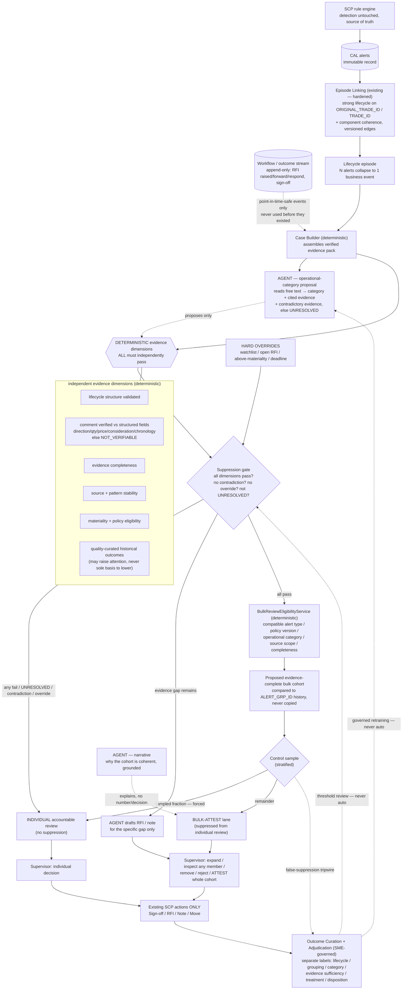

# Non-BAU Suppression — End-to-End Flow

**Aim.** Not "classify each alert as BAU / non-BAU." The aim is to **remove items from the supervisor's individual accountable-review queue** — genuine volume suppression — and to test whether agents plus this architecture let us suppress *more* items *safely* than a deterministic-only system.

**The one definition that keeps this honest.** "Suppress as non-BAU" here means: **route an item out of individual accountable review into an attested-bulk lane or a sampled lane — it does not mean delete the alert.** SCP detection is untouched; the CAL alert and its record are immutable. Accountability is preserved by *attestation + a forced control sample*, not removed. We therefore measure **false-suppression** (things routed out that should have been reviewed), never raw count reduction. Raw reduction is not proof of control effectiveness, and we never claim it is.

---

## The flow, start to end

---

## Reading the flow start to end

**1. Detection stays where it is.** SCP fires alerts exactly as today; the CAL record is immutable and the workflow/outcome stream (RFI events, sign-offs) is a *second, append-only* input. Nothing here changes what SCP detects, and the workflow stream is walled off from every point-in-time decision made before those events existed — an RFI response or a bulk sign-off can never leak backward into linking or scoring. This wall is what stops the system from "learning" that whatever was signed off in bulk before must be BAU now.

**2. First suppression — structural, and the safest one (episode collapse).** The existing Episode Linking, hardened with component-coherence checks and versioned edges, collapses the several alerts thrown off by one business event into a **single lifecycle episode**. This is the largest and least risky volume win: if one cancel-rebook lifecycle fired three alerts, the supervisor now has *one* item to account for, not three. It is fully deterministic and asserts only *shared lifecycle* — it does not yet claim the item is benign. No agent is involved.

**3. Evidence assembly — the only place an agent touches the suppression path, and only to propose.** Case Builder deterministically assembles the evidence pack. Then the **one agent that matters for suppression** reads the free-text explanation and *proposes* an operational-reason category — "cancel/amend/rebook correction," "preliminary-to-final," "feed/mapping remediation," and so on — but it must cite the evidence, cite any *contradictory* evidence, and return **UNRESOLVED** rather than force a fit. That proposal is an input to a deterministic gate; it is never a verdict. This is the precise boundary that lets us use an LLM's one real strength (reading text nothing else can read) without letting it decide anything.

**4. The suppression gate — many independent deterministic dimensions, all must pass.** An item is eligible to leave individual review only if **every** independent dimension passes: the lifecycle structure is validated; the free-text claim is *verified against the structured fields* (a stated reversal must match direction/quantity/price/consideration/chronology, or it is marked `NOT_VERIFIABLE_FROM_AVAILABLE_FIELDS` — absence of contradiction is never treated as confirmation); evidence is complete; the source and pattern are stable; it is below materiality and policy-eligible; and curated history is consistent (history may *raise* attention but can never be the sole reason to *lower* it). Any single failure, any contradiction, any UNRESOLVED category, or any hard override (watchlist, open RFI, above-materiality, near deadline) sends it straight to **individual accountable review**. Suppression has to earn *all* the dimensions; review is the default.

**5. Second suppression — the real volume mechanism (bulk-attest cohort).** Items that clear the gate are not auto-closed. A deterministic eligibility service groups compatible ones — same alert type, policy version, operational category, source scope, completeness — into a **proposed evidence-complete cohort**, compared against `ALERT_GRP_ID` history but never blindly copying it. A stratified **control sample** is peeled off and *forced* into individual review regardless (the false-negative tripwire). The remainder enters the **bulk-attest lane**: the supervisor can expand it, inspect any member's full evidence, remove members, reject the whole group, or **attest it in one action**. This is where genuine volume suppression happens — one attestation stands in for what used to be dozens of individual reviews — while every member keeps its own evidence and the human keeps accountability through the attestation.

**6. Third suppression — RFI avoidance.** When the gate finds an item *almost* complete but for a specific missing fact, the agent drafts the RFI or note for *that gap only*. Because Evidence Readiness surfaces what is already present earlier, many reviews that would have triggered a round-trip RFI are resolved from evidence on hand — a reduction in the most expensive workflow step, measured directly.

**7. Human decides; nothing is closed by the system.** Every path ends at the supervisor acting through SCP's existing actions (Sign-off / RFI / Note / Move). The system prepares, proposes, and drafts; it does not sign off, send an RFI, or write a disposition. The agent runtime holds no credential capable of any of those, so the free text it reads cannot become an instruction that acts.

**8. The loop closes under governance.** Outcomes flow to an SME-governed curation service that stores *separate* labels (lifecycle correctness, grouping appropriateness, category, evidence sufficiency, treatment, disposition) — never collapsed into one BAU/non-BAU flag. The control-sample results feed the **false-suppression tripwire**: if sampled items that were headed for the bulk lane turn out to need review, the gate thresholds go to human review, never auto-adjust. The system learns; it never changes itself.

---

## Where agents help — and the honest limit

Agents touch exactly three points, all *proposal-only*: category proposal at the gate's input, the cohort-coherence narrative, and RFI drafting. They **widen suppression coverage** — by reading free text, they let more items reach a *confidently categorized, verified* state than deterministic parsing alone could, so more items legitimately qualify for the bulk-attest lane. That is the real "agents make it better" claim, and it is measurable.

What agents do **not** do: they do not compute the evidence dimensions, do not decide eligibility, do not form the cohort, do not attest, and do not close anything. Every suppression *decision* is deterministic and reproducible; the human *attests*. If you removed the agents entirely, the deterministic system would still suppress via collapse and the gate — just over a smaller fraction of items, because more free-text cases would land in UNRESOLVED and fall back to individual review.

---

## Why this is better than classification — and how it is proven

A classifier hands the supervisor a label and still makes them review everything; it reduces nothing. This flow reduces the count of **individually reviewed items** through three real mechanisms — episode collapse, bulk-attest cohorts, and RFI avoidance — while a fourth (grouping/context) only speeds each remaining review and is *not* counted as suppression.

"Better" is not asserted; it is measured by running four variants on the same SME-adjudicated cases — (a) manual/today, (b) linking + consolidated presentation, (c) deterministic Case Builder + evidence-readiness + bulk logic, (d) the same plus grounded narrative/Q&A — and attributing each gain to the component that produced it. **The agentic system counts as better only where variant (d) safely suppresses more than variant (c) at equal-or-lower false-suppression.** The headline metric is not "alerts reduced" but the pair **{safely-suppressed fraction, false-suppression rate}**, backed by control-sample outcomes, supervisor overrides, and reopened-case rate.

**The defensible sentence for the room.** *We suppress genuine volume — collapsing lifecycle alerts into single episodes, and moving multi-dimensionally-verified items into attested bulk cohorts and out of individual review — while detection stays untouched, every suppression decision stays deterministic and reproducible, a forced control sample bounds our blind spot, and the human still attests. Agents don't decide what's suppressed; they read the text that lets more items qualify safely. We prove the gain by measuring safe-suppression against false-suppression, not by counting alerts.*
