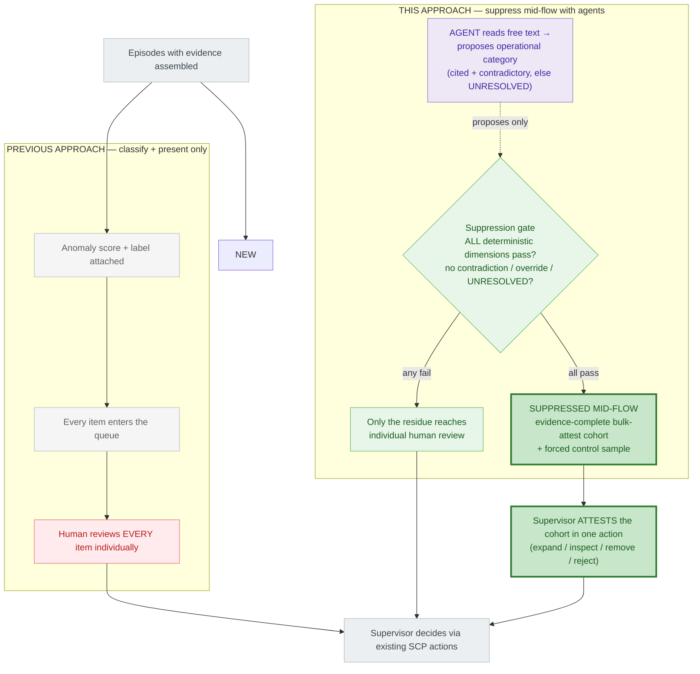

# Pitch — What This Approach Does That the Previous One Could Not

**The two capabilities the previous approach did not have, and this one does:**

1. **It suppresses alerts mid-flow** — items leave the individual accountable-review queue *before* a human touches them, via structural collapse and an evidence-gated bulk-attest lane. The previous approach could only ever *classify and present* — every alert still reached a human for individual review.
2. **It uses agents** — to read the free text nothing else can read, so *more* items qualify safely for suppression. The previous approach had no agent anywhere in the path.

Everything else — SCP untouched, episode reconstruction, explainability, immutable results, human accountability, governed learning — is **shared** and is *not* what this pitch is about. This document deliberately foregrounds only the delta.

---

## The delta, in one diagram

The left path is the previous approach. The right path is this one. The only structural difference is the shaded band: **mid-flow suppression driven by agent-widened evidence.** Everything above it is effectively the same; everything the previous approach did, ended at "human reviews every item."

Read the diagram by the colours: the **red terminal** on the left — "human reviews *every* item" — is the ceiling the previous approach could never break. The **purple agent node** and the **thick-bordered green suppression node** on the right are the two things that are genuinely new, and they are what let most items *never reach* individual review.

---

## The pitch

### The previous approach hit a ceiling it was honest about

The prior design grouped alerts, scored them, and explained them well. But it was **not allowed to suppress anything mid-flow, and used no agents** — so by its own admission it "does not reduce the number of alerts requiring accountable review." It made each review *faster*; it could not make reviews *fewer*. Every alert it processed still landed on a supervisor for individual accountable review. That is a hard ceiling: with review headcount fixed, faster-per-item only stretches so far, and bulk sign-off — where supervisors actually spend their time — got no structural help at all.

### This approach breaks that ceiling in two specific places

**Difference 1 — suppression happens mid-flow, before a human is spent on it.** Instead of routing every item to individual review, an evidence gate decides — deterministically and reproducibly — whether an item can leave the individual queue entirely. Items that clear it are assembled into an **evidence-complete bulk-attest cohort**: the supervisor inspects and **attests the whole cohort in one action** instead of reviewing each member. One attestation now stands in for what used to be dozens of individual reviews. This is the structural volume reduction the previous approach could not perform — not because it was badly built, but because it was not permitted to act mid-flow.

**Difference 2 — agents widen how much can be suppressed safely.** The gate is only as useful as the fraction of items it can confidently clear, and the blocker is free text — cancel reasons, correction notes — that deterministic parsing cannot categorize. This is where the agent earns its place: it **reads the free text and proposes the operational category**, with cited and contradictory evidence, or returns `UNRESOLVED`. That single capability moves items that would otherwise fall back to individual review into a *confidently categorized, verified* state where they qualify for suppression. The previous approach had no way to do this — so those items simply stayed in the queue.

### Why the two differences are safe (pre-empting the obvious objection)

The reviewer's first question will be "so an LLM now closes alerts?" No — and the design is built so it structurally cannot:

- **The agent only proposes; the gate is deterministic.** The suppression *decision* is reproducible code over independent evidence dimensions (verified lifecycle, comment-checked-against-fields, completeness, stability, materiality, curated history). The agent never computes a dimension, never decides eligibility, never attests.
- **Suppressed does not mean closed.** The alert and its record are immutable; SCP detection is untouched. "Suppressed" means *moved out of individual review into an attested lane* — the human still attests, with every member's evidence intact.
- **A forced control sample is the tripwire.** A random fraction of would-be-suppressed items is pushed back to individual review no matter what, bounding the blind spot and catching false-suppression before it compounds.
- **Hard overrides sit above everything** — watchlist, open RFI, above-materiality, near-deadline items can never be suppressed.

### The claim, scoped so it survives scrutiny

Against the previous approach, the win is not "we added AI." It is: **we moved from a system that could only classify-and-present every alert to one that safely removes items from individual review mid-flow — and agents are what make that removal wide enough to matter.** It is proven by comparing the two on the same adjudicated cases: the previous approach's individual-review count versus this approach's, at a measured false-suppression rate. The agent's contribution is isolated by asking whether it raises the safely-suppressed fraction *beyond* what the deterministic gate alone achieves. If it does, agents are justified; if it does not, we keep the deterministic suppression and drop the agent from that path. Either way, we can say precisely what each difference bought.

**One line for leadership:** *The previous approach made every review faster but left the number of reviews untouched, because it could neither suppress mid-flow nor read the text that would justify suppression. This approach does both — deterministically deciding what leaves individual review, and using agents only to widen how much can leave safely — while detection, immutability, and human accountability stay exactly as before.*
