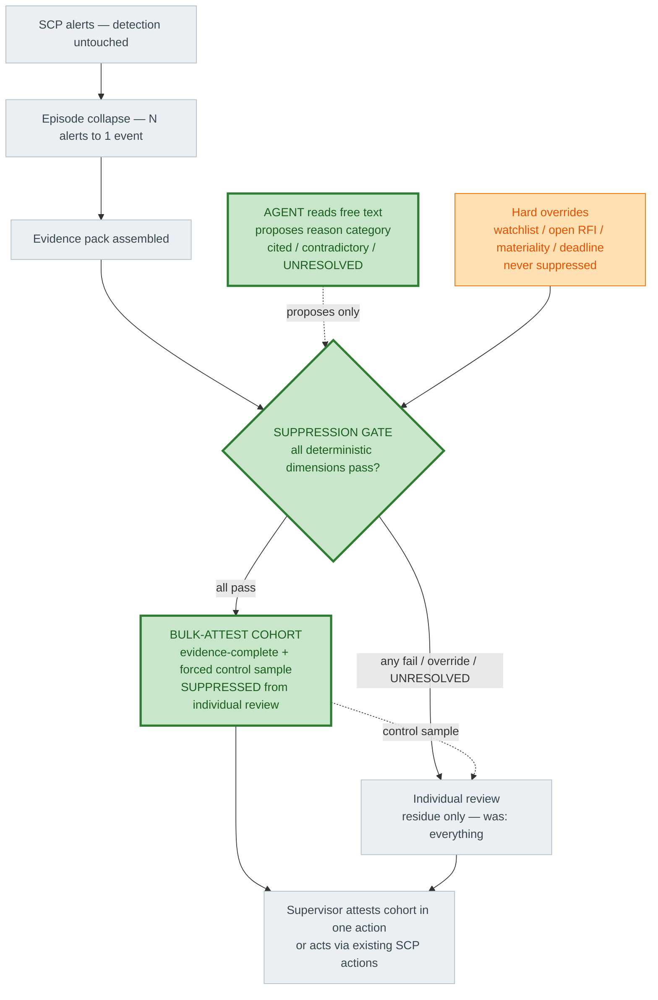

# Pitch Pack — Understanding, Script, and Diagram

Three separate pieces. **Part 1** is for you, to understand it. **Part 2** is the script you speak. **Part 3** is the single diagram you point at while speaking — mid-complexity, whole solution, USPs highlighted. They are independent; use each on its own.

---

# PART 1 — The explanation (for you)

**What the whole solution does.** SCP still detects and fires alerts (untouched). Those alerts are collapsed into business episodes, an evidence pack is assembled, and then — this is the new part — an **evidence gate decides, deterministically, whether an item can leave individual review entirely.** Items that clear it go into a **bulk-attest cohort** the supervisor signs off in one action; only the residue goes to individual review. An **agent** reads the free-text explanations so that *more* items can clear the gate safely.

**The three things that are genuinely ours (the USPs):**

1. **Mid-flow suppression, not classification.** The previous approach attached a label and sent every item to a human. Ours removes qualifying items from individual review *before* a human is spent on them. That is the difference between "faster reviews" and "fewer reviews."

2. **An agent doing the one thing only an agent can.** Free text (cancel reasons, correction notes) is what blocks deterministic categorization. The agent reads it and proposes the operational category — with cited and contradictory evidence, or `UNRESOLVED`. This *widens* how many items can be suppressed safely. It proposes only; it never decides.

3. **Bulk-attest as the volume vehicle.** Supervisors spend their time on bulk sign-off. Instead of dozens of individual reviews, they inspect and attest one evidence-complete cohort. One attestation replaces many reviews, with every member's evidence intact.

**Why it is safe (the part that makes it allowed).** The suppression *decision* is deterministic and reproducible — the agent never makes it. "Suppressed" means moved out of individual review into an attested lane, not closed; the alert record is immutable and detection is untouched. A forced **control sample** pushes a random fraction back to individual review as a false-negative tripwire, and **hard overrides** (watchlist, open RFI, above-materiality, deadline) can never be suppressed.

**The honest claim.** Not "we added AI." It is: *we moved from classify-and-present-everything to safely removing items from individual review mid-flow, and the agent is what makes that removal wide enough to matter.* Proven by comparing individual-review counts on the same adjudicated cases at a measured false-suppression rate — and by isolating whether the agent raises safe-suppression beyond the deterministic gate alone.

**If challenged with "the old one just wasn't allowed to suppress":** the constraint was the point. Ours is the design that makes mid-flow suppression *safe enough to be permitted* — deterministic decision, attestation, control sample, overrides. That is a stronger claim than "we turned suppression on."

---

# PART 2 — The pitch script (to speak)

> Spoken version. Short sentences. Pause at each `//`.

"Let me show you the whole flow, and then the two things it does that the previous approach could not.

The previous approach was good at what it did. It grouped related alerts, scored them, and explained them. // But it was not allowed to suppress anything, and it used no agents. // So every alert it processed still reached a supervisor for individual review. It made each review faster. It never made the reviews fewer.

Our approach breaks that ceiling in two places. //

First — suppression happens mid-flow. Before a human is spent on an item, a deterministic gate decides whether it can leave individual review entirely. // The items that clear it are assembled into an evidence-complete cohort, and the supervisor attests the whole cohort in one action, instead of reviewing every item inside it. // One attestation replaces dozens of individual reviews. That is the structural volume reduction the previous approach could not perform.

Second — this is where the agent earns its place. // The gate can only clear an item if the evidence is complete, and the thing that blocks that is free text — cancel reasons, correction notes — that ordinary logic can't categorize. // The agent reads that text and proposes the reason category, with its supporting and contradicting evidence, or it says UNRESOLVED. // That moves items that would otherwise fall back to manual review into a state where they can be safely suppressed. The previous approach had no way to do this.

Now the question you're about to ask — does an AI now close alerts. // No. The agent only proposes. The suppression decision is deterministic and reproducible. // Suppressed doesn't mean closed — the alert record is immutable, detection is untouched, and the human still attests. // A random control sample is always forced back to full review, so we can measure anything we miss. And watchlist, open-RFI, materiality, and deadline items can never be suppressed.

So the claim is not 'we added AI.' // It's that we moved from a system that classified and presented every alert, to one that safely removes items from individual review mid-flow — and the agent is what makes that removal wide enough to matter. // And we prove it: same cases, previous approach's review count versus ours, at a measured false-suppression rate.

The core line: the previous approach made every review faster but left the number of reviews untouched. // Ours reduces the number — deterministically deciding what leaves individual review, and using an agent only to widen how much can leave safely — while detection, immutability, and accountability stay exactly as before."

---

# PART 3 — The diagram (to point at)

Shared spine is plain; the three USPs are marked. Walk it top to bottom: alerts come in unchanged, collapse into episodes, an evidence pack is built — then the **gate** (USP 1) decides, fed by the **agent** (USP 2), routing most items into the **bulk-attest lane** (USP 3) and only the residue to individual review.

**Three things to say at the three green nodes, in order:**
- **Agent (USP 2):** "This is the only agent in the path. It reads the text nothing else can, and it *proposes* — it never decides."
- **Suppression gate (USP 1):** "This is the difference from before. A deterministic decision on whether an item leaves individual review — not a label on an item that still gets reviewed."
- **Bulk-attest cohort (USP 3):** "This is the volume win. One attestation instead of dozens of reviews — with a control sample forced back, and overrides that can never be suppressed."
