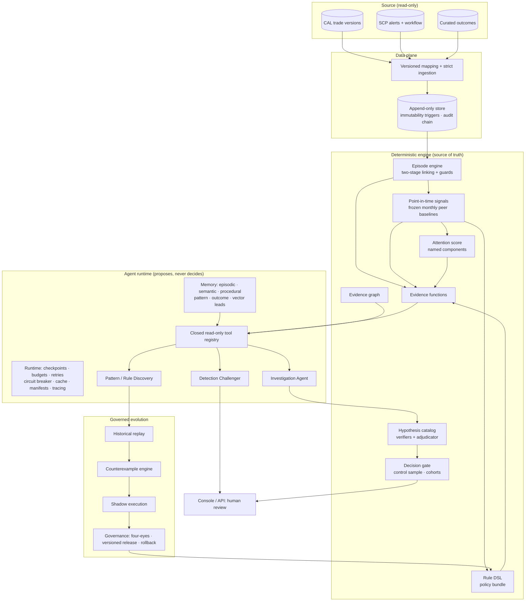

# Architecture

## 1. The shift from the previous design

| Previous (ML-centric) | ASAS |
|---|---|
| Features → rule baseline + Isolation Forest + supervised model → fused score | Named, point-in-time signals → **deterministic attention score** (every component explained) |
| SHAP explains *the model* | Evidence-cited narratives explain *the case*: which hypotheses were tested, what supported or contradicted them |
| Score ranks; humans investigate | **Agents investigate**: competing hypotheses, targeted evidence retrieval, verification, abstention |
| Supervised model learns from past sign-offs | Only **curated** outcomes are labels; history may raise attention, never lower it |
| Retraining is the only way to adapt | **Discovery → candidate rules → replay → counterexamples → shadow → four-eyes release** |
| Detection logic is opaque to the model | Detection logic is a constrained DSL in a versioned policy bundle the agents can read, challenge and propose changes to |

## 2. Layers

## 3. Components

### Episode engine (`engine/linking.py`)
Deterministic linking is canonical and runs in two stages:
- **Strong core:** the same `TRADE_ID` lifecycle, plus `ORIGINAL_TRADE_ID` lineage (tier S).
- **Medium attachments:** shared `URN_REF` and `ALTERNATE_TRADE_ID` (tier M). They are accepted only if the key is not degenerate (config blocklist and patterns), the key's fan-out is bounded (hubs are demoted), the trades are close in time, the instrument matches, and the merged episode stays within the maximum span.

Rejected links are kept with a reason. Plausible but unproven relationships (untagged cancel/rebook) become **residue pairs** for the agents. Human-confirmed agent links are applied as an overlay (tier A) under the same guards.

### Signals and scoring (`engine/signals.py`, `engine/scoring.py`)
Signals are computed only from records with `record_time <= eval_time`. Examples: price and quantity change, booking latency, rebook repricing, period-end proximity, price round-trip, recurrence, signature rarity. Peer baselines are frozen per calendar month (a lookback window ending at the month start), use mid-rank percentiles and robust z-scores, and name the peer population and its size. The score is a sum of named components; overrides (open RFI, materiality, watchlist) force bucket B0. The score orders work and raises attention; **it never makes a case bulk-eligible**.

### Rule DSL and policy bundles (`engine/rules.py`)
A rule is a conjunction of conditions over named signals (`numeric`, `flag` or `label`), with parameters. It has no code and no expressions, and the condition count is capped in config. A **policy bundle** (detection rules plus bulk-review policy) is immutable and versioned, and each one records its parent, its creator and the candidate it came from.

### Evidence, hypotheses and adjudication (`engine/evidence.py`, `engine/hypotheses.py`)
Evidence functions return bounded, typed views. They never return raw rows; free text is delimited as untrusted; person data requires entitlement.

The hypothesis catalog holds benign, anomalous and context hypotheses. Each declares its **evidence requirements** and a **deterministic verifier** returning SUPPORTED, CONTRADICTED or INSUFFICIENT; a missing fact gives INSUFFICIENT, never confirmation. The adjudicator's order of precedence:
1. A supported anomaly.
2. A supported benign explanation, if no benign alternative is left unresolved.
3. Otherwise, abstain.

### Agent runtime (`agents/runtime.py`)
One loop runs every agent program:
- **Idempotency:** the run id is a hash of agent, prompt, model, tool schema, config, snapshot, subject and principal scope. Completed runs replay from their record.
- **Checkpoints** after every step, with resume after a crash.
- **Budgets:** steps, tool calls, model calls and wall time.
- **Model decisions:** schema-validated actions, one repair attempt, then the **deterministic playbook fallback**.
- **Gateway:** resilient, with retries and a circuit breaker, plus a response cache for replay-by-record.
- A **manifest** per run, with OTel-compatible spans and JSON logs.

### Agents
- **Investigation Agent** (`agents/investigator.py`): proposes hypotheses, calls the tools a hypothesis still needs, asks the verifier, proposes links, then concludes or abstains. A conclusion is accepted only if the adjudicator agrees *and* every applicable competing hypothesis was evaluated. An LLM policy and a playbook policy share the same action schema.
- **Detection Challenger** (`agents/challenger.py`): works through candidate findings (blind spots, missing context, alternative explanations, redundant detections), gathers evidence, and confirms (verifier-checked) or dismisses. Dismissed findings stay visible.
- **Pattern / Rule Discovery** (`agents/discovery.py`): tests synthesized rules with `simulate_candidate_rule`, refines them within the DSL, rejects duplicates or covered patterns, and proposes DRAFT candidates. Recurring benign patterns become bulk-policy proposals.

### Tools (`agents/tools.py`)
The closed registry has 20 typed read-only tools, including: `get_alert`, `get_episode`, `get_trade`, `get_trade_history`, `compare_trade_versions`, `get_event_sequence`, `get_related_alerts`, `get_related_episodes`, `get_trader_baseline` (person-data entitlement, raise-only), `get_peer_comparison`, `get_recurrence`, `get_prior_outcomes`, `get_rule`, `get_subrules`, `get_rule_parameters`, `compare_trades`, `search_evidence_graph`, `find_similar_cases` (lead-only), `replay_rule` and `simulate_candidate_rule`.

Every call passes through the same checks: capability → argument schema → entitlement → cache → timed execution → typed bounded output → audit.

### Evidence graph (`engine/graph.py`)
The graph covers trades, versions, alerts, rules, subrules, parameters, books, desks, instruments, episodes, outcomes, patterns and agent proposals. Edges carry a status (CANONICAL, PROPOSED, VERIFIED, REJECTED) and a provenance (deterministic linking version, agent run, or human). The graph version is a content hash.

### Memory (`agents/memory.py`)
- **Episodic:** past investigations.
- **Semantic:** entity profiles.
- **Procedural:** the versioned hypothesis catalog.
- **Pattern:** discovered patterns.
- **Outcome:** curated labels only.
- **Vector index:** hashed TF-IDF; results are **leads, never evidence**, and cannot enter verification.

### Evolution (`evolution/*`)
- **Replay:** current rules vs current rules plus the candidate, with each episode evaluated as of `end + delay`.
- **Counterexample attack:** false positives, false negatives on the rule's target typology, boundary cases, mutation survivors, near-misses and temporal instability.
- **Shadow execution:** on the most recent, unlabelled window, with no side effects.
- **Governance:** a state machine with four-eyes approval, immutable bundles, and activation with rollback.

## 4. Deterministic boundary (enforced, not promised)

| Concern | Enforcement |
|---|---|
| Agents cannot write | Agent programs import no store or I/O modules (static test); tools are read-only views over a frozen snapshot; readers are `mode=ro` + `query_only` |
| Agents cannot invent facts | Actions are schema-validated; prose with numbers outside `[E#]` citations is rejected; conclusions are checked by the adjudicator |
| Agents cannot change production | Governance requires human principals, role checks, four-eyes approval and the ordered evidence chain |
| Agent links are not canonical | Stay VERIFIED or quarantined until an analyst confirms them |
| Prompt injection | Free text is delimited and neutralised, never executed; a model obeying injected text is rejected by verification (tested) |
| Point in time | Store reads filter on `record_time <= as_of`; signals are computed at eval time; outcomes are used only if `decided_at < as_of` |
| Person / workflow fields | Quarantined in annexes; decision modules never reference them (static test) |
| History | Only curated outcomes are labels; context can only add `HISTORY_ADVERSE` |

## 5. Reliability

- Idempotent ingestion; in-place source changes are rejected.
- Idempotent agent runs (replay-by-record).
- Checkpoint and resume after a crash (tested).
- Model retries with backoff, a circuit breaker and playbook fallback (tested).
- A crashing runtime sends cases to individual review with `AGENT_UNAVAILABLE` (tested).
- Budgets on every run.
- A hash-chained audit log whose tampering is detected (tested).
- JSON logs correlated with trace and span ids; OTLP/JSON span export.
