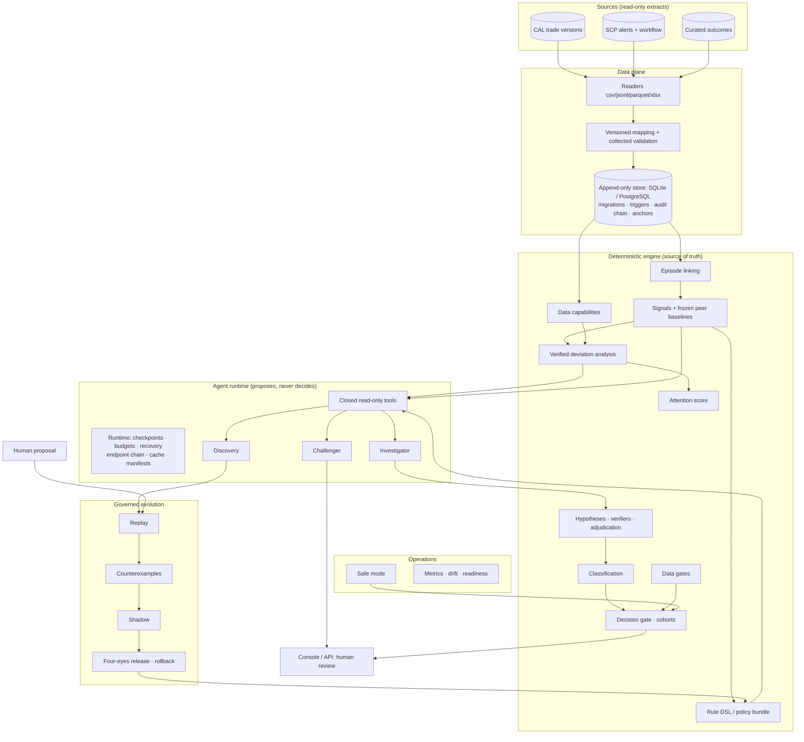

# Architecture

## 1. The shift from the previous design

| Previous (ML-centric) | ASAS |
|---|---|
| Features → rule baseline + Isolation Forest + supervised model → fused score | Named point-in-time signals → **verified deviation analysis** (named peers, multi-level confirmation, stability, data quality, rare combinations) and a **deterministic attention score** |
| SHAP explains *the model* | Each case states *how outlying, versus whom, whether it is real, whether it is explained*, and cites the evidence behind every hypothesis |
| Outliers rank benign size and misconduct together | Deviations a **verified benign explanation** accounts for are subtracted; only **unexplained** deviation raises a case; it can never be bulk-proposed |
| Score ranks; humans investigate | **Agents investigate**: competing hypotheses, targeted evidence retrieval, deterministic verification, abstention |
| Supervised model learns from past sign-offs | Only **curated** outcomes are labels; history may raise attention, never lower it |
| Retraining is the only way to adapt | **Discovery or human proposal → replay → counterexamples → shadow → four-eyes release** |

## 2. Layers

```mermaid
flowchart TD
    subgraph Source["Sources (read-only extracts)"]
        CAL[(CAL trade versions)]
        SCP[(SCP alerts + workflow)]
        OUT[(Curated outcomes)]
    end
    subgraph Data["Data plane"]
        RD[Readers csv/jsonl/parquet/xlsx]
        MAP[Versioned mapping + collected validation]
        STORE[(Append-only store: SQLite / PostgreSQL<br/>migrations · triggers · audit chain · anchors)]
    end
    subgraph Engine["Deterministic engine (source of truth)"]
        CAP[Data capabilities]
        GATE[Data gates]
        LINK[Episode linking]
        SIG[Signals + frozen peer baselines]
        DEV[Verified deviation analysis]
        SCORE[Attention score]
        RULES[Rule DSL / policy bundle]
        HYP[Hypotheses · verifiers · adjudication]
        CLS[Classification]
        DEC[Decision gate · cohorts]
    end
    subgraph Agents["Agent runtime (proposes, never decides)"]
        RT[Runtime: checkpoints · budgets · recovery<br/>endpoint chain · cache · manifests]
        INV[Investigator]
        CH[Challenger]
        DISC[Discovery]
        TOOLS[Closed read-only tools]
    end
    subgraph Evolution["Governed evolution"]
        REP[Replay] --> CEX[Counterexamples] --> SHD[Shadow] --> GOV[Four-eyes release · rollback]
    end
    subgraph Ops["Operations"]
        OPS[Safe mode] 
        MON[Metrics · drift · readiness]
    end
    CAL & SCP & OUT --> RD --> MAP --> STORE
    STORE --> LINK --> SIG --> DEV --> SCORE
    STORE --> CAP --> DEV
    SIG --> RULES
    DEV & SIG & RULES --> TOOLS --> INV & CH & DISC
    INV --> HYP --> CLS --> DEC --> UI[Console / API: human review]
    GATE & OPS --> DEC
    CH --> UI
    DISC --> REP
    HUMAN[Human proposal] --> REP
    GOV --> RULES
```

## 3. One daily run, end to end

```mermaid
sequenceDiagram
    participant Job as Scheduler
    participant P as Platform
    participant S as Store
    participant E as Engine
    participant A as Agent runtime
    participant M as Model (optional)
    Job->>P: run_pipeline(as_of)
    P->>S: load_bundle(as_of): point-in-time rows only
    P->>E: snapshot: linking, signals, baselines, capabilities, deviation profiles, scores, detections
    P->>E: data_gates(freshness, volume) + ops state
    loop each alerted episode in the review window (worker pool)
        P->>A: investigate(episode)
        A->>M: next action? (observation + suggested action)
        M-->>A: JSON action (validated; repaired once; else playbook)
        A->>E: tools (read-only) / evaluate hypothesis / propose link
        A-->>P: result (conclusion or abstention, unexplained deviations)
    end
    P->>E: decide_case + classify + cohorts (blocked by gates / safe mode)
    P->>S: cases, cohorts, run report, KPIs, drift, audit entry
    P->>S: anchor audit chain head (signed, external sink)
```

## 4. Components (by package)

| Package | Responsibility | Key modules |
|---|---|---|
| `core` | config + overlays, auth (dev/proxy/OIDC), readiness, security principals, metrics, rate limit, tracing, logging, business context | `config.py`, `auth.py`, `readiness.py`, `metrics.py`, `context.py` |
| `data` | contract, readers, mapping and validation, profiling and draft mapping, synthetic data | `contract.py`, `readers.py`, `ingest.py`, `profiling.py`, `synthetic.py` |
| `store` | dialects, migrations, append-only store, audit anchors | `dialect.py`, `migrations.py`, `db.py`, `anchor.py` |
| `engine` | all decisions (pure, deterministic) | `linking.py`, `signals.py`, `deviation.py`, `capabilities.py`, `gates.py`, `scoring.py`, `rules.py`, `evidence.py`, `hypotheses.py`, `classification.py`, `decisions.py`, `graph.py`, `challenge.py`, `discovery.py`, `items.py` |
| `agents` | runtime, gateway chain, prompts, tools, Investigator, Challenger, Discovery, memory | `runtime.py`, `gateway.py`, `tools.py`, `investigator.py` |
| `evolution` | replay, counterexamples, shadow, governance | `governance.py` |
| `services` | orchestration and harnesses | `platform.py`, `ops.py`, `monitoring.py`, `integration.py`, `evaluation.py`, `llm_eval.py`, `bench.py`, `demo.py` |
| `api` | FastAPI + console | `app.py`, `static/` |

### Episode linking (`engine/linking.py`)
Deterministic linking is canonical:
- **Strong:** the same `TRADE_ID` lifecycle and `ORIGINAL_TRADE_ID` lineage.
- **Medium:** `URN_REF` / `ALTERNATE_TRADE_ID`, only when the key is not degenerate, fan-out is bounded, the trades are close in time and on the same instrument, and the episode stays within the maximum span.

Unproven relationships become residue pairs. Agents propose links; the links are verified deterministically and canonical only after human confirmation.

### Signals, baselines and verified deviation (`engine/signals.py`, `engine/deviation.py`)
Signals are computed only from records with `record_time <= eval_time`. Peer baselines are frozen per month and cover desk+product, desk, global and the book itself. Deviation analysis screens every behavioural signal, verifies it (multi-level confirmation, stability against a shifted reference, data-quality exclusion, field availability), finds rare combinations of individually common facts, and outputs named outlyingness components. Details: [anomaly-analysis.md](anomaly-analysis.md).

### Data capabilities and gates (`engine/capabilities.py`, `engine/gates.py`)
Field coverage per snapshot decides which hypotheses, signals and rules can run; anything missing degrades to INSUFFICIENT and never to a guess. Freshness and volume gates block bulk for a run on stale or partial data.

### Hypotheses, adjudication and classification (`engine/hypotheses.py`, `engine/classification.py`)
Each hypothesis declares its evidence requirements, the optional fields it relies on, and a deterministic verifier (SUPPORTED, CONTRADICTED or INSUFFICIENT). Adjudication precedence:
1. a typed anomaly
2. an unexplained verified deviation (`VERIFIED_PEER_DEVIATION`, after subtracting what supported benign hypotheses explain)
3. a benign explanation with nothing unresolved
4. abstain

Classification adds category, typology, severity (materiality-aware) and confidence from named lines of evidence.

### Decisions (`engine/decisions.py`)
Bulk is proposed only for a verified benign conclusion with no reason at all against it:
- no override, high attention, data-quality issue, unconfirmed link, data gate or safe mode
- not in the control sample
- inside the approved bulk policy

Typed anomalies are recommended for escalation. Unexplained deviations escalate by band; otherwise they get prioritised individual review. Nothing is closed by the system.

### Agent runtime (`agents/runtime.py`)
- **Idempotency:** run id = hash of agent, prompt, model, tool schema, config, snapshot, subject and scope; completed runs replay from their record.
- **Checkpoints** after every step, with resume.
- **Budgets:** steps, tool calls, model calls and time.
- **Model steps:** actions are schema-validated with one repair attempt; the observation is fitted to the context window by dropping the oldest items, keeping the JSON valid.
- **Recovery:** after `max_consecutive_rejections` stalled steps (rejected, failed or no progress) the playbook finishes the run. A model may abstain only where the verifier would.
- **Model calls** go through retries, a circuit breaker and an ordered endpoint chain, then the deterministic playbook.

### Tools (`agents/tools.py`)
21 typed read-only tools, including `get_deviation_profile`. Every call passes: capability → argument schema → entitlement → cache → timed execution → bounded typed output → audit record → metrics.

### Evolution and governance (`evolution/*`)
Discovered or human-proposed candidates go through replay (point-in-time, curated labels only), counterexamples, shadow, submit, and four-eyes approval. Releases are immutable bundles with a parent, the source candidate and rollback.

### Security, storage and operations
See [security.md](security.md), [deployment.md](deployment.md) and [operations.md](operations.md): OIDC or a proxy, readiness guard, CSP, rate limit; PostgreSQL roles and migrations; signed audit anchors; safe mode; metrics, drift and runbooks.

## 5. Deterministic boundary (enforced, not promised)

| Concern | Enforcement |
|---|---|
| Agents cannot write | Agent programs import no store or I/O modules (static test); tools are read-only views over a frozen snapshot; readers are read-only at the database level |
| Agents cannot invent facts | Schema-validated actions; prose with numbers outside `[E#]` citations is rejected; conclusions and abstentions are checked by the adjudicator |
| Agents cannot change production | Governance requires human principals, role checks, four-eyes and the ordered evidence chain; agents have no governance tool |
| Unexplained behaviour cannot be bulk-closed | Adjudication and the decision gate (rail 15, tested) |
| Missing data cannot look clean | Capabilities → INSUFFICIENT; gates → degraded run (tested) |
| Identity cannot be forged | OIDC/proxy authenticators; dev headers refused in prod (tested) |
| History cannot be rewritten unnoticed | Append-only triggers, least-privilege roles, hash chain, signed external anchors (tested) |
| Prompt injection | Free text fenced as untrusted; hijacked or looping models hand over to the playbook (tested with scripted and real models) |
| Point in time | `record_time <= as_of` on every read; outcomes only if `decided_at < as_of` |
| Person / workflow fields | Quarantined in annexes; decision modules never reference them (static test) |

## 6. Where to change what

| Change | File(s) | Playbook |
|---|---|---|
| New source / columns | `config/mappings/*.toml` | [integrate-real-data](playbooks/integrate-real-data.md) |
| Thresholds | `config/asas.toml` | [calibrate-thresholds](playbooks/calibrate-thresholds.md) |
| Rules, bulk policy | `asas propose` → governance | [change-rules-and-policy](playbooks/change-rules-and-policy.md) |
| New signal | `engine/signals.py` + config + context | [add-signal](playbooks/add-signal.md) |
| New typology / explanation | `engine/hypotheses.py` + config + context | [add-hypothesis](playbooks/add-hypothesis.md) |
| New contract field | `data/contract.py`, `domain/models.py`, `data/ingest.py` | [add-contract-field](playbooks/add-contract-field.md) |
| Reviewer wording | `config/business_context.toml` | [change-business-context](playbooks/change-business-context.md) |
| Model | `[agents]` config | [swap-model](playbooks/swap-model.md) |
| Environment | `config/overlays/*.toml` | [deployment](deployment.md) |
